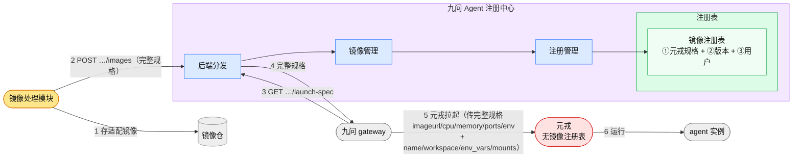
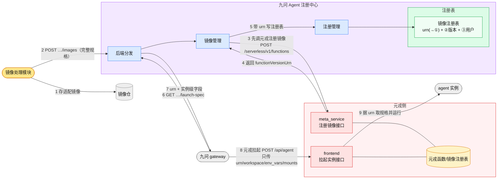

# 镜像元数据归属：两套方案对比

> 讨论用。焦点只有一个问题：**元戎的镜像运行规格（`cpu` / `memory` / `imageurl` / `ports` / `env` …）由谁持有、在哪个时刻交给元戎。**
>
> - **当前方案**：注册中心是规格的**唯一持有方**，元戎不维护镜像注册表；gateway 拉起实例时把**完整规格一次性传给元戎**。注册中心**不调元戎**。
> - **改版方案**：注册中心登记镜像时**同时调元戎的注册镜像接口**，把规格也登记进元戎、拿回 `functionVersionUrn`；gateway 拉起时**只传 `urn` + 实例级字段**，规格已在元戎侧。
>
> 绘制风格同[设计文档](./一体机Agent%20OS%20registry设计文档.md) §3 逻辑视图：🟪 注册中心 / 🟦 一级模块 / 🟩 注册表 / ⬜ 外部模块 / 🟧 外部·镜像处理模块 / 🟥 元戎。实线箭头 = 调用；**箭头上的数字 = 步骤顺序**。两图中元戎统一用 🟥（含其内部函数/镜像注册表用 🟨）。

**目录**

- [1. 镜像注册表的三类元数据](#1-镜像注册表的三类元数据)
- [2. 当前方案（元戎不维护镜像注册表）](#2-当前方案元戎不维护镜像注册表)
- [3. 改版方案（元戎额外维护一套镜像注册表）](#3-改版方案元戎额外维护一套镜像注册表)
- [4. 逐项对比](#4-逐项对比)
- [5. 讨论要点（待定）](#5-讨论要点待定)

---

## 1. 镜像注册表的三类元数据

无论哪套方案，注册中心镜像注册表的**一行（= 一个框架版本）**都由**三类元数据**构成——这也是理解两方案分歧的基础：**分歧只落在第①类（元戎所需）由谁持有**，第②③类两方案完全相同、始终留在注册中心。

| # | 类别 | 用途 | 对应字段（镜像注册表，见[设计文档](./一体机Agent%20OS%20registry设计文档.md) §4.2）|
|---|------|------|------|
| ① | **元戎所需元数据** | 供元戎注册镜像 / 拉起实例的运行规格 | `imageurl` · `workdir` · `mounts` · `cpu` · `memory` · `ports` · `env` · `rootfs.user`（运行用户）· `runtime` · `sandboxType` |
| ② | **版本管理元数据** | 多版本与默认版本管理、检索与排序 | `framework` · `framework_version` · `version_key` · `is_default` · `image_module_version` |
| ③ | **用户信息元数据** | 归属与审计 | `uploaded_by`（上传者）· `created_at`（登记时间）|

- **当前方案**：三类**全部**存注册中心；第①类在 gateway 拉起时**原样传给元戎**。
- **改版方案**：第①类在注册时**推送进元戎**、由元戎持有一份，注册中心改存一个指向它的句柄 **`urn`**（第①类是否在注册中心**再留一份副本**，是 [§5](#5-讨论要点待定) 待定项）；第②③类**不变**，仍只在注册中心。

> 换言之：**②版本管理**和**③用户信息**是注册中心的固有职责、元戎不关心；两方案争的只是**①元戎所需规格**该在注册中心持有、还是下沉进元戎并以 `urn` 引用。

---

## 2. 当前方案（元戎不维护镜像注册表）

镜像处理模块把完整运行规格登记进注册中心；注册中心**只记录、不调元戎**。gateway 拉起实例时经 `GET …/launch-spec` 取回**完整规格**，自行调元戎拉起——元戎在拉起那一刻才第一次见到该镜像的规格。

- **注册（步骤 2）**：`POST /api/images`，body 含完整 `spec`（`imageurl` / `cpu` / `memory` / `ports` / `env` / `workdir` / `mounts` / `image_module_version`）。注册中心直接落库，**不产生对外调用**。
- **拉起（步骤 5）**：gateway 取回镜像级规格后，拼上实例级字段（`name`=service_id、`workspace`、`env_vars`、`mounts`）**一次性传给元戎**。
- **注销**：`DELETE /api/images/{fw}/{ver}` → 校验无在用实例 → 删镜像仓文件 + 删注册表条目。**全程不涉及元戎**。

---

## 3. 改版方案（元戎额外维护一套镜像注册表）

注册中心登记镜像时，**先调元戎的注册镜像接口**把规格也注册进元戎、拿回 `functionVersionUrn`，**再把 `urn` 连同元数据写入自己的注册表**。规格从此在**元戎与注册中心两侧各存一份**。gateway 拉起时只把 `urn` + 实例级字段交给元戎，元戎据 `urn` 自行取规格。

> **关键时序约束**：`urn` 是元戎注册接口的**响应**，所以镜像管理必须 **①先调元戎、②再写注册表**——顺序不可换（先写库则 `urn` 字段为空）。

- **注册（步骤 3–5）**：镜像管理先 `POST ${META_SERVICE_ENDPOINT}/serverless/v1/functions`（传 `name` / `kind=agent` / `runtime` / `cpu` / `memory` / `sandboxType=docker` / `rootfs{imageurl,user,ports}` 等），期望 `HTTP 200` + `functionVersionUrn`；再把 `urn` 与元数据写镜像注册表。
- **拉起（步骤 8）**：gateway `POST ${FRONTEND_ENDPOINT}/api/agent`，只传 `name` / `namespace` / `urn` / `workspace` / `env_vars` / `mounts`，期望 `{code:200, instance_id}`。规格由元戎据 `urn` 自取。
- **注销**：`DELETE /api/images/{fw}/{ver}` → 校验无在用实例 → **先调元戎注销函数**（`DELETE /serverless/v1/functions/{name}?versionNumber={ver}`）→ 再删镜像仓文件 + 删注册表条目。**多一次对元戎的外部调用**（失败处理见 §5）。

---

## 4. 逐项对比

| 维度 | 当前方案 | 改版方案 |
|------|----------|----------|
| **规格持有方** | 注册中心（唯一） | 注册中心 + 元戎（两份） |
| **注册中心是否调元戎** | 否 | **是**（注册、注销各一次外部调用）|
| **镜像注册时序** | 单步落库 | **两步且有序**：先调元戎拿 `urn` → 再写库 |
| **`launch-spec` 返回** | 完整运行规格 | `urn` + 实例级字段（不含 cpu/memory/rootfs）|
| **gateway 拉起传参** | 完整规格 + 实例级字段 | 仅 `urn` + `workspace`/`env_vars`/`mounts` |
| **元戎首次见到镜像** | 拉起那一刻 | 注册那一刻（提前） |
| **新增失败面** | 无对外依赖 | 注册/注销依赖元戎在线；需处理 `urn` 写库前崩溃、元戎注销失败等 |
| **注册中心与元戎数据一致性** | 不涉及 | **需维护**：注册表 `urn` 与元戎函数须同生共灭，否则出现孤儿函数 / 悬空 urn |
| **拉起链路耦合** | gateway 掌握全部规格 | 规格下沉元戎；gateway 更薄，但强依赖 `urn` 有效 |
| **对既有设计文档的改动量** | 无（即现状） | 需改：`POST /api/images` 时序、`launch-spec` 返回、镜像注册表增 `urn` 列、注销加元戎调用 |

---

## 5. 讨论要点（待定）

> 以下为改版方案落地前需拍板的开放问题——**当前方案不涉及这些**，故也是两方案取舍的实质分歧点。

1. **元戎函数名 `name`（如 `0@myService@python-agent`）由谁生成？**
   - 选项 A：注册中心按 `framework` + `framework_version` 确定性派生（与 `service_id` 风格一致，镜像处理模块无需关心）。
   - 选项 B：镜像处理模块在 `POST /api/images` 时传入 `function_name`，注册中心原样透传给元戎。

2. **`launch-spec` 到底返回哪些字段？**
   - 至少 `urn`；实例级字段（`namespace` / 镜像级 `env_vars` / 镜像级 `mounts`）是否也一并返回，由 gateway 合并用户态字段？

3. **元戎注销失败时，注册中心是否仍删注册表条目？**
   - 选项 A（严格）：元戎 `DELETE` 失败即中止、返回 `502`，条目与镜像仓文件均不动，可重试——避免孤儿函数。
   - 选项 B（可用性优先）：仍删条目，响应带 warning，可能在元戎侧残留孤儿函数。
   - 选项 C：加 `?force=true` 由调用方决定。

4. **注册两步的原子性**：元戎注册成功、但注册中心写库前崩溃 → 元戎侧出现无人引用的函数。是否需要对账 / 幂等重注册机制？

5. **`rootfs.user`（运行用户）从哪来？** 元戎注册镜像要求 `kind=agent` + `sandboxType=docker` 时 `rootfs.user` 必填（缺失返回 `400`）。该字段由镜像处理模块提供、随 `spec` 上报，还是注册中心按框架约定填默认值？
