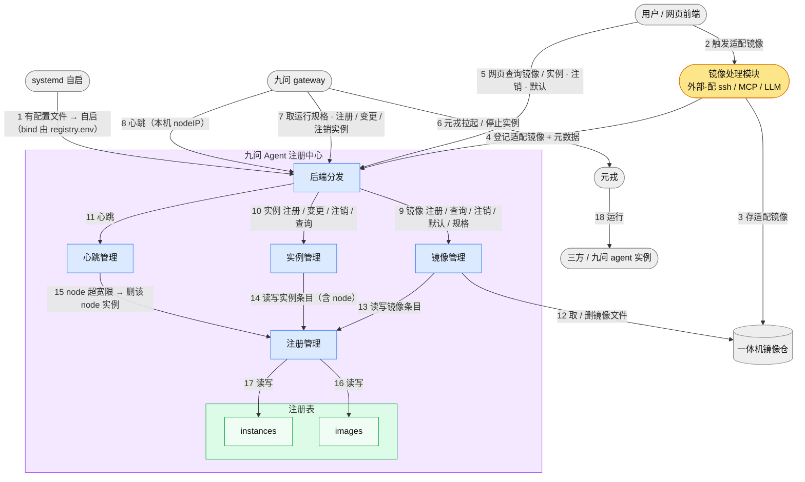
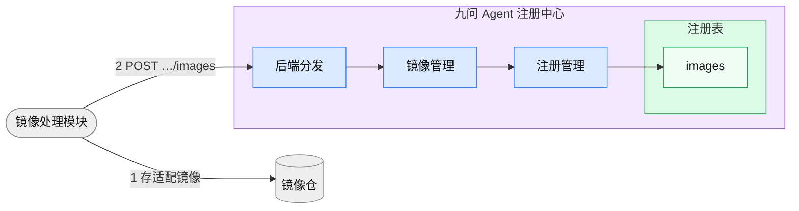
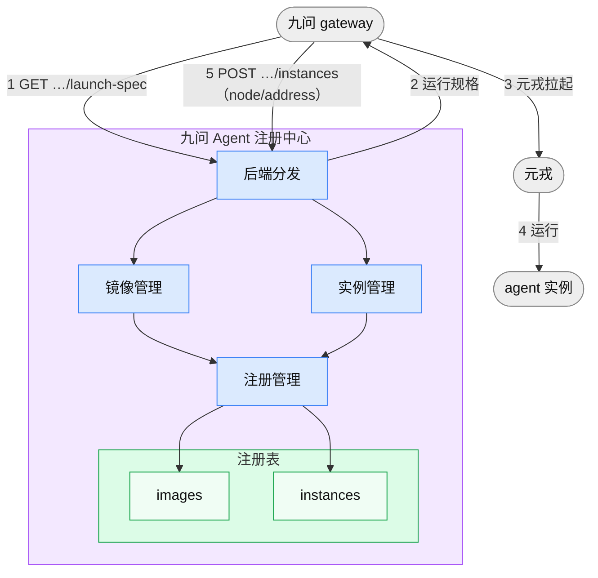
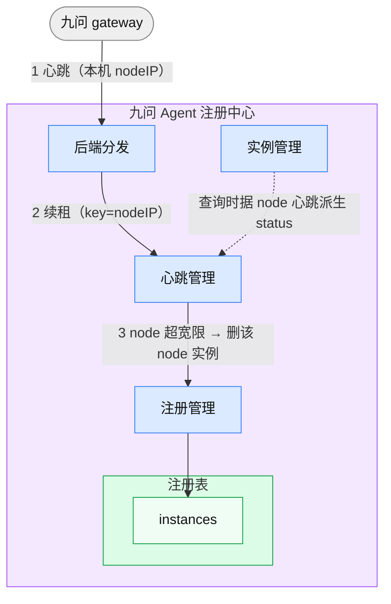
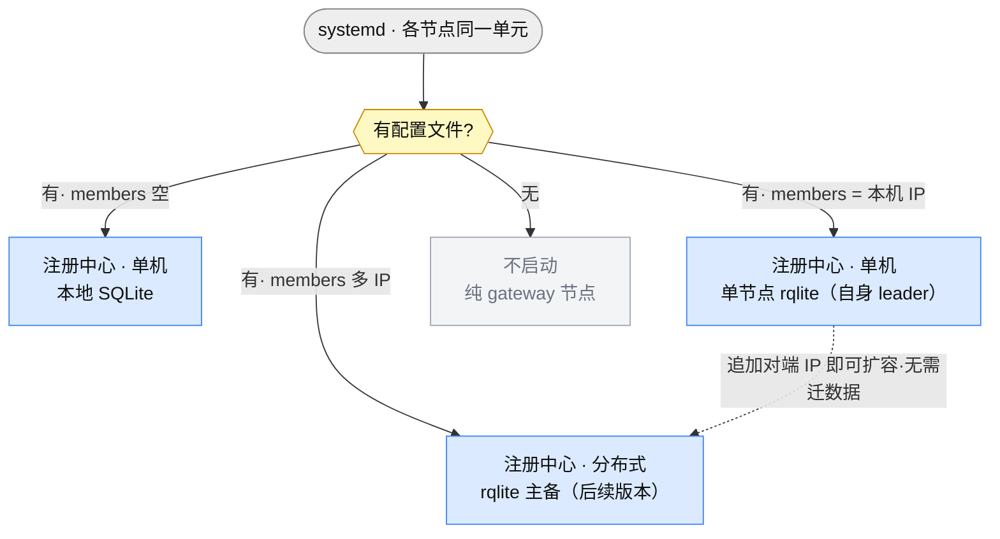
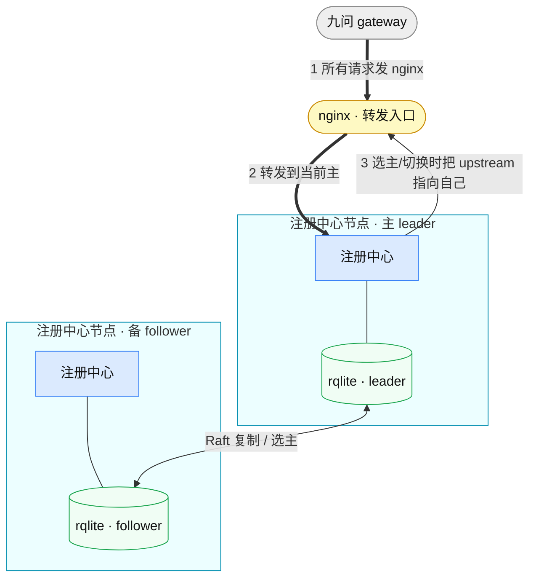

# 一体机 Agent OS registry 设计文档

> 一体机场景下，九问 Agent 注册中心负责**三方 Agent 框架镜像的管理**（注册 / 查询 / 注销 / 多版本）与 **Agent 实例的管理**（三方 / 九问）。**注册中心是纯记录方**：不调元戎、不替 gateway 决策；gateway 自行拉起 / 停止实例并把结果写入注册中心，用户经注册中心查询实例。适配镜像由**外部镜像处理模块**产出并自行登记。**730 版本为单机**：**监听地址由 `registry.env` 配置（默认 `127.0.0.1`）**、不启鉴权；单机存储可选**本地 SQLite** 或**单节点 rqlite**（`A2X_REGISTRY_HA_MEMBERS` 只填本机 IP，自身即 leader——为后续平滑扩成多节点预留）；多节点分布式高可用（rqlite 主备 + nginx 转发到主）为后续版本。
>
> 本文档只写 **1 功能列表 · 2 整体视图 · 3 场景逻辑视图 · 4 注册表示例 · 5 其他材料**；模块内部实现、接口清单见 §5 指向的[实现文档](./一体机Agent%20OS%20registry实现文档V2.md)与 [`registry_openapi_v2.yaml`](./registry_openapi_v2.yaml)。

**目录**

- [1. 功能列表](#1-功能列表)
- [2. 整体视图](#2-整体视图)
- [3. 场景逻辑视图](#3-场景逻辑视图)
  - [3.1 镜像管理](#31-镜像管理)
  - [3.2 实例管理](#32-实例管理)
  - [3.3 启动与分布式](#33-启动与分布式)
- [4. 示例](#4-示例)
  - [4.1 启动配置文件](#41-启动配置文件registryenv)
  - [4.2 镜像注册表](#42-镜像注册表)
  - [4.3 实例注册表](#43-实例注册表)
- [5. 其他材料](#5-其他材料)

---

## 1. 功能列表

| 域 | 功能 | 发起方 | 说明 |
|----|------|--------|------|
| **镜像** | 镜像注册 | 镜像处理模块 | 适配镜像引用 + 元戎运行规格登记进镜像注册表 |
| | 镜像查询 | 用户 | 列框架版本（一条目 = 一行，扁平；支持分页，一页 N 个框架版本）|
| | **取运行规格** | gateway | 拉起前查框架默认版本的元戎运行规格（`launch-spec`）|
| | 设默认版本 | 用户 | 指定某版本为默认；未设取框架版本最新 |
| | 镜像注销 | 用户 | 校验无在用实例 → 删镜像仓文件 + 删条目 |
| **实例** | **实例注册** | gateway | 自行拉起后带落点（node / address）写入注册表 |
| | **实例变更** | gateway | 落点变化（元戎迁移，node / address 改变）时更新条目 |
| | **实例注销** | gateway | 自行停元戎后删条目 |
| | **实例查询** | 用户 | 列实例及派生状态（运行 / 异常）；支持分页，一页 N 个实例 |
| | 存活监控 | gateway | 按 node 发心跳；超 TTL 派生 `异常`、超宽限删该 node 实例 |
| **平台** | 独立自启 | systemd | 有配置文件即起注册中心，监听地址由 `registry.env` 配置（空=localhost）、不启鉴权 |
| | 存储后端选择 | 注册中心 | 据 `A2X_REGISTRY_HA_MEMBERS` 分流：空 → 本地 SQLite；只填本机 IP → 单节点 rqlite；多 IP → 多节点 rqlite |
| | 分布式 HA | 注册中心 | rqlite 主备复制 + 选主，nginx 转发到主（后续版本）|
| | 客户端 SDK | gateway | httpx 长连；镜像 / 实例 / 心跳接口封装 |

**核心边界**：
- **注册中心不调元戎**——元戎拉起 / 停止实例由 gateway 完成；注册中心只登记 / 变更 / 注销 / 查询。
- **gateway 只写不查（实例）**——gateway 对实例做注册 / 变更 / 注销，不做实例查询来决定是否拉起（由 gateway 自行决策）；拉起前只查**镜像运行规格**。
- **用户读实例**——实例查询由用户经 UI 发起。
- **service_id** 由 **(user, framework) 确定性派生**——每用户每框架**只有一个实例**（同 user+framework → 同 service_id → 注册幂等覆盖，单例即由此保证）。gateway 计算后随注册带上，并据此寻址变更 / 注销。

---

## 2. 整体视图

**一级模块（对应 `a2x_registry/` 文件夹）**

| 模块 | 对应代码 | 职责 |
|------|---------|------|
| **后端分发** | `backend/` | HTTP API 路由（监听地址由 `registry.env` 配置（空=localhost）、不启鉴权）|
| **注册管理** | `register/` | 注册 / 变更 / 注销 / 查询（各表通用 CRUD）|
| **镜像管理** | `image/` | 镜像注册 / 查询 / 注销 / 多版本与默认版本 / 取运行规格 |
| **实例管理** | `instance/` | 实例注册 / 变更 / 注销 / 查询（纯记录，不调元戎）|
| **心跳管理** | `heartbeat/` | 心跳续租 / 过期回调（策略可注入：默认剔除、一体机按 node 批量剔除）|
| **注册表** | `register/store` | 镜像注册表 / 实例注册表（SQLite；多机 rqlite 为后续版本）|

**外部模块**：网页前端 / 用户 · 九问 gateway · **元戎**（Docker 沙箱；**由 gateway 调用拉起 / 停止**，注册中心不调用）· 三方 / 九问 agent 实例 · 一体机镜像仓 · **镜像处理模块**（把原始镜像适配为可运行镜像**并登记进注册中心**；由用户前端触发）· **nginx**（分布式发现入口，后续版本）· 其他注册中心（分布式对端，后续版本）。



> 🟪 注册中心 / 🟦 一级模块 / 🟩 注册表 / ⬜ 外部模块 / 🟧 外部·镜像处理模块。实线箭头 = 调用；**箭头上的数字 = 步骤顺序**；分布式 nginx / rqlite 见 §3.3。

---

## 3. 场景逻辑视图

> 每个场景标注**外部交互接口**（方法 + 路径、输入示例、输出示例）；完整请求 / 响应 / 错误契约见 [`registry_openapi.yaml`](./registry_openapi.yaml)。镜像 / 实例为**固定命名注册表**接口（`/api/images`、`/api/instances`，不分 dataset——数据落固定的「镜像注册表」「实例注册表」）；node 心跳、ha 为全局。

**分页约定**（`GET /api/images`、`GET /api/instances` 两个列表接口共用，**参数与响应头同通用服务列表 `GET /api/datasets/{dataset}/services` 完全一致**，见 [`docs/backend_api.md`](https://github.com/Weizheng96/A2X-registry/blob/main/docs/backend_api.md)）：

| 参数 | 类型 | 默认值 | 说明 |
|------|------|--------|------|
| `size` | int | `-1` | 分页大小；`-1` 返回全部（不分页）|
| `page` | int | `1` | 页码（从 1 开始），仅 `size>0` 时生效 |

**分页响应头**（仅 `size>0` 时设置）：`X-Total-Count`（匹配总数）· `X-Page`（当前页码）· `X-Total-Pages`（总页数）· `X-Page-Size`（当前页大小）。响应体恒为**数组**，不做 `{items, total}` 包装——分页元数据一律走 header。`size` / `page` 为**保留参数不参与过滤**（同 `include_unhealthy` / `framework` / `node` 等各接口自有的保留参数，见各场景）。

**分页单位**：两个接口**都是「一页 = N 个条目」，一条目 = 一行**，返回**扁平数组**——分页单位与存储单位同级。

| 接口 | 一页 = | `X-Total-Count` | 一元素 = |
|------|--------|-----------------|----------|
| `GET /api/instances` | N **个实例** | 过滤后的实例数 | 一个实例（实例注册表一行）|
| `GET /api/images` | N **个框架版本** | 过滤后的**版本行数** | 一个框架版本（镜像注册表一行）|

镜像**不做按框架分组的层次化返回**：镜像注册表一行 = 一个框架版本（§4.2），条目就按行扁平返回，`framework` 与 `is_default` 是行上的普通字段。这样存储、接口、分页三者同一个单位，分页是直白的 `LIMIT/OFFSET`：

```sql
-- X-Total-Count
SELECT COUNT(*) FROM images;
-- 一页
SELECT * FROM images
ORDER BY framework ASC, version_key DESC, json_extract(data, '$.created_at') DESC
LIMIT :size OFFSET :offset;
```

> 排序把同一框架的各版本排在**相邻位置**，前端要「框架 → 版本」的树，按 `framework` 就地 group 一次即可，信息没丢。框架的版本集**可以跨页**（第 N 页页尾是 `langgraph v0.2.0`、第 N+1 页页首是 `langgraph v0.1.0`）——这是扁平分页的正常行为，不是缺陷。
>
> `created_at` 存在 `data` JSON 里（§4.2）而非独立列，故末位比较走 `json_extract`。它只在 `version_key` 相同时才起作用——即同框架下多个**版本号不合规**的条目（`version_key` 均为兜底值），量级极小，不必为它单开列或建索引。

**确定序**（分页的前提，非优化项）：无全序时 SQLite 不保证 `LIMIT/OFFSET` 跨页稳定，翻页会重复或漏行，故两张表各定一个**全序**：

| 注册表 | 排序 | 说明 |
|--------|------|------|
| 镜像注册表 | `framework ASC, version_key DESC, json_extract(data,'$.created_at') DESC` | 框架名升序；框架内**新版本在前**。`is_default` **不参与排序**，只作标记 |
| 实例注册表 | `framework ASC, user ASC, service_id ASC` | `service_id` 是主键，兜底保证全序 |

> `version_key` 是**注册时算好并落库的规范化排序键**（§4.2），不是 `framework_version` 本身——直接按字符串排会把 `v0.10.0` 排在 `v0.2.0` 之前。之所以落库而非查询时算，是因为排序必须在 SQL 内完成才谈得上下推，而 SQLite 无法在 SQL 里解析语义化版本号。

### 3.1 镜像管理

三方框架镜像的注册、查询、注销与多版本管理；适配镜像由外部镜像处理模块产出，注册中心只登记引用 + 元戎运行规格并检索。九问框架镜像条目随一体机预置。

#### 3.1.1 镜像注册

用户经网页触发**镜像处理模块**：把原始镜像按框架配好 ssh / MCP / LLM / liveness 探针、适配为可运行镜像、存入镜像仓；随后**镜像处理模块自行调用注册中心**登记适配镜像引用 + 元戎运行规格（经注册管理写镜像注册表）。



- **接口**：`POST /api/images`（发起方：镜像处理模块）
- **输入示例**：
  ```json
  { "framework": "opencode", "framework_version": "v0.2.0",
    "runtime_spec": { "rootfs": {"imageurl": "harbor.local/adapted/opencode:v0.2.0-mod1.3"},
      "cpu": 1000, "memory": 2048, "ports": [ { "port": 8080, "protocol": "tcp" } ],
      "env": { "A2X_LLM_KEY": "${A2X_LLM_KEY}" }, "image_module_version": "v1.3" },
    "uploaded_by": "user-01" }
  ```
- **输出示例**：`{ "framework": "opencode", "framework_version": "v0.2.0", "status": "registered" }`

#### 3.1.2 镜像查询

用户经网页查询镜像（经注册管理读镜像注册表）。**一条目 = 一个框架版本**（即注册表一行），返回**扁平数组**、不按框架分组。支持**分页**（`size` / `page`，同 §3 分页约定；**一页 = N 个框架版本**）。

- **接口**：`GET /api/images`（发起方：用户）
- **筛选参数**：`framework`（按框架）· `uploaded_by`（按上传者）；保留参数 `size` / `page` 不参与筛选
- **顺序**：`framework` 升序 → `version_key` 降序（**新版本在前**，见 §4.2）。同框架各版本因此**相邻**，前端要「框架 → 版本」的树按 `framework` 就地 group 即可。不分页（`size=-1`）时同样成立

**筛选语义**：筛选直接作用在**行**上，命中即返回该行——无分组，故不存在「框架命中但某些版本被筛掉」这类歧义。`is_default` 是行上的普通字段，跟着行走。

> 以下三例共用同一份镜像注册表快照：**12 个框架版本行**、分属 7 个框架。其中 `user-01` 上传了 4 行（`crewai` v0.4.0、`langgraph` v0.3.1、`opencode` v0.2.0 / v0.1.0）。全序为：`aider` v0.8.0 · `autogen` v0.4.0 · `claude-code` v1.0.0 / v0.9.0 · `crewai` v0.5.0 / v0.4.0 · `jiuwen-report` v1.0.0 · `langgraph` v0.3.1 / v0.2.0 / v0.1.0 · `opencode` v0.2.0 / v0.1.0。

**例 1 · 全列表查询**（不带 `size` → 不分页、返回全部 12 行）

```http
GET /api/images
```

```http
200 OK
（无 X-Total-Count / X-Page / X-Total-Pages / X-Page-Size —— 仅 size>0 时设置）
```

```json
[
  { "framework": "aider", "framework_version": "v0.8.0", "is_default": true,
    "rootfs": {"imageurl": "harbor.local/adapted/aider:v0.8.0-mod1.3"},
    "image_module_version": "v1.3", "uploaded_by": "user-02",
    "created_at": "2026-07-02T09:10:00Z" },
  { "framework": "autogen", "framework_version": "v0.4.0", "is_default": true,
    "rootfs": {"imageurl": "harbor.local/adapted/autogen:v0.4.0-mod1.3"},
    "image_module_version": "v1.3", "uploaded_by": "user-02",
    "created_at": "2026-07-01T10:00:00Z" },
  { "framework": "claude-code", "framework_version": "v1.0.0", "is_default": true,
    "rootfs": {"imageurl": "harbor.local/adapted/claude-code:v1.0.0-mod1.3"},
    "image_module_version": "v1.3", "uploaded_by": "user-02",
    "created_at": "2026-07-05T11:00:00Z" },
  { "framework": "claude-code", "framework_version": "v0.9.0", "is_default": false,
    "rootfs": {"imageurl": "harbor.local/adapted/claude-code:v0.9.0-mod1.2"},
    "image_module_version": "v1.2", "uploaded_by": "user-02",
    "created_at": "2026-06-30T16:40:00Z" },
  { "framework": "crewai", "framework_version": "v0.5.0", "is_default": true,
    "rootfs": {"imageurl": "harbor.local/adapted/crewai:v0.5.0-mod1.3"},
    "image_module_version": "v1.3", "uploaded_by": "user-02",
    "created_at": "2026-07-04T08:00:00Z" },
  { "framework": "crewai", "framework_version": "v0.4.0", "is_default": false,
    "rootfs": {"imageurl": "harbor.local/adapted/crewai:v0.4.0-mod1.2"},
    "image_module_version": "v1.2", "uploaded_by": "user-01",
    "created_at": "2026-06-25T13:30:00Z" },
  { "framework": "jiuwen-report", "framework_version": "v1.0.0", "is_default": true,
    "rootfs": {"imageurl": "harbor.local/adapted/jiuwen-report:v1.0.0-mod1.3"},
    "image_module_version": "v1.3", "uploaded_by": "system",
    "created_at": "2026-06-20T00:00:00Z" },
  { "framework": "langgraph", "framework_version": "v0.3.1", "is_default": true,
    "rootfs": {"imageurl": "harbor.local/adapted/langgraph:v0.3.1-mod1.3"},
    "image_module_version": "v1.3", "uploaded_by": "user-01",
    "created_at": "2026-07-07T15:05:00Z" },
  { "framework": "langgraph", "framework_version": "v0.2.0", "is_default": false,
    "rootfs": {"imageurl": "harbor.local/adapted/langgraph:v0.2.0-mod1.2"},
    "image_module_version": "v1.2", "uploaded_by": "user-03",
    "created_at": "2026-06-26T09:00:00Z" },
  { "framework": "langgraph", "framework_version": "v0.1.0", "is_default": false,
    "rootfs": {"imageurl": "harbor.local/adapted/langgraph:v0.1.0-mod1.1"},
    "image_module_version": "v1.1", "uploaded_by": "user-03",
    "created_at": "2026-06-18T09:00:00Z" },
  { "framework": "opencode", "framework_version": "v0.2.0", "is_default": true,
    "rootfs": {"imageurl": "harbor.local/adapted/opencode:v0.2.0-mod1.3"},
    "image_module_version": "v1.3", "uploaded_by": "user-01",
    "created_at": "2026-07-06T10:00:00Z" },
  { "framework": "opencode", "framework_version": "v0.1.0", "is_default": false,
    "rootfs": {"imageurl": "harbor.local/adapted/opencode:v0.1.0-mod1.1"},
    "image_module_version": "v1.1", "uploaded_by": "user-01",
    "created_at": "2026-06-28T14:20:00Z" }
]
```

> 12 个元素（每元素 = 一行）。同框架各版本相邻且**新版本在前**（`claude-code` v1.0.0 先于 v0.9.0、`langgraph` v0.3.1 → v0.2.0 → v0.1.0）。每框架恰有一行 `is_default: true`。为示例简洁，各行省略了 `cpu` / `memory` / `ports` / `env` / `workdir` / `mounts` 等运行规格字段（完整字段见 [`registry_openapi.yaml`](./registry_openapi.yaml) 的 `ImageEntry`）。

**例 2 · 分页列表查询**（一页 4 行，取第 2 页）

```http
GET /api/images?size=4&page=2
```

```http
200 OK
X-Total-Count: 12      # 框架版本行总数
X-Page: 2
X-Total-Pages: 3       # ceil(12 / 4)
X-Page-Size: 4
```

```json
[
  { "framework": "crewai", "framework_version": "v0.5.0", "is_default": true,
    "rootfs": {"imageurl": "harbor.local/adapted/crewai:v0.5.0-mod1.3"},
    "image_module_version": "v1.3", "uploaded_by": "user-02",
    "created_at": "2026-07-04T08:00:00Z" },
  { "framework": "crewai", "framework_version": "v0.4.0", "is_default": false,
    "rootfs": {"imageurl": "harbor.local/adapted/crewai:v0.4.0-mod1.2"},
    "image_module_version": "v1.2", "uploaded_by": "user-01",
    "created_at": "2026-06-25T13:30:00Z" },
  { "framework": "jiuwen-report", "framework_version": "v1.0.0", "is_default": true,
    "rootfs": {"imageurl": "harbor.local/adapted/jiuwen-report:v1.0.0-mod1.3"},
    "image_module_version": "v1.3", "uploaded_by": "system",
    "created_at": "2026-06-20T00:00:00Z" },
  { "framework": "langgraph", "framework_version": "v0.3.1", "is_default": true,
    "rootfs": {"imageurl": "harbor.local/adapted/langgraph:v0.3.1-mod1.3"},
    "image_module_version": "v1.3", "uploaded_by": "user-01",
    "created_at": "2026-07-07T15:05:00Z" }
]
```

> 全序里的第 5–8 行。注意 `langgraph` 的 3 个版本**跨页**：v0.3.1 落在本页页尾，v0.2.0 / v0.1.0 在第 3 页——扁平分页下这是正常行为。

**例 3 · 分页列表 + 按用户筛选**（`user-01` 上传的镜像，一页 2 行，第 1 页）

```http
GET /api/images?uploaded_by=user-01&size=2&page=1
```

```http
200 OK
X-Total-Count: 4       # 筛选后的行数（crewai v0.4.0、langgraph v0.3.1、opencode v0.2.0 / v0.1.0）
X-Page: 1
X-Total-Pages: 2       # ceil(4 / 2)
X-Page-Size: 2
```

```json
[
  { "framework": "crewai", "framework_version": "v0.4.0", "is_default": false,
    "rootfs": {"imageurl": "harbor.local/adapted/crewai:v0.4.0-mod1.2"},
    "image_module_version": "v1.2", "uploaded_by": "user-01",
    "created_at": "2026-06-25T13:30:00Z" },
  { "framework": "langgraph", "framework_version": "v0.3.1", "is_default": true,
    "rootfs": {"imageurl": "harbor.local/adapted/langgraph:v0.3.1-mod1.3"},
    "image_module_version": "v1.3", "uploaded_by": "user-01",
    "created_at": "2026-07-07T15:05:00Z" }
]
```

> 筛选只挑命中的**行**：`crewai` 只回 v0.4.0（v0.5.0 是 user-02 传的，不返回），`is_default: false` 如实反映该行不是默认版本——不存在框架级字段与行级字段打架的问题。第 2 页为 `opencode` v0.2.0 / v0.1.0。

#### 3.1.3 取运行规格

gateway 拉起实例**前**查此拿元戎运行规格；不带 `version` 取框架默认版本。镜像管理据默认版本组合返回。

- **接口**：`GET /api/images/{framework}/launch-spec`（发起方：gateway）
- **输入示例**：`GET …/images/opencode/launch-spec`（可选 `?version=v0.2.0`）
- **输出示例**：
  ```json
  { "framework": "opencode", "framework_version": "v0.2.0",
    "rootfs": {"imageurl": "harbor.local/adapted/opencode:v0.2.0-mod1.3"},
    "cpu": 1000, "memory": 2048, "ports": [ { "port": 8080, "protocol": "tcp" } ],
    "env": { "A2X_LLM_KEY": "${A2X_LLM_KEY}" } }
  ```
  > 均为**镜像级**字段；gateway 拉起时再补**实例级**字段（`sandbox_type="docker"`、`host_user`=user、`name`=service_id、`lifecycle="detached"`、`idle_timeout`）。

#### 3.1.4 设默认版本 / 3.1.5 镜像注销

- **设默认版本**：`PUT /api/images/{framework}/default`（用户）。输入 `{ "framework_version": "v0.2.0" }` → 输出 `{ …, "default": "v0.2.0", "status": "updated" }`。
- **镜像注销**：`DELETE /api/images/{framework}/{version}`（用户）。**先校验无在用实例**（查实例注册表），无则删镜像仓文件 + 删该版本；有在用则 `409`。输出 `{ …, "status": "deregistered" }`。

### 3.2 实例管理

Agent 实例（三方 / 九问）的注册 / 变更 / 注销 / 查询 / 存活监控。**gateway 自行决定是否拉起**（不查注册中心）：拉起前经 §3.1.3 取运行规格 → 自行调元戎拉起 → 向注册中心**注册**；落点变化时**变更**；关闭时自行停元戎后**注销**。**用户**查询实例及状态。三方与九问同一套流程，仅九问框架镜像条目预置。**注册中心不调元戎**，是纯记录方。

#### 3.2.1 实例注册

gateway 取运行规格 → 自行调元戎拉起、取落点 node / address → 向实例管理注册（写条目）。



本场景用到**两个接口**：先取运行规格（步骤 1），再注册实例（步骤 5）。

**接口 ①（步骤 1）取运行规格**：`GET /api/images/{framework}/launch-spec`（发起方：gateway；同 §3.1.3）
- **输入示例**：`GET …/images/opencode/launch-spec`（不带 `version` 取默认版本）
- **输出示例**：`{ "framework": "opencode", "framework_version": "v0.2.0", "rootfs": {"imageurl": "harbor.local/adapted/opencode:v0.2.0-mod1.3"}, "cpu": 1000, "memory": 2048, "ports": [ { "port": 8080, "protocol": "tcp" } ], "env": { "A2X_LLM_KEY": "${A2X_LLM_KEY}" } }`

**接口 ②（步骤 5）注册实例**：`POST /api/instances`（发起方：gateway）
- **输入示例**：
  ```json
  { "service_id": "generic_3f9a1b2c", "kind": "三方", "framework": "opencode",
    "framework_version": "v0.2.0", "node": "192.168.0.12",
    "address": "10.244.1.7:4096", "user": "user-01" }
  ```
- **输出示例**：`{ "service_id": "generic_3f9a1b2c", "kind": "三方", …, "status": "运行" }`

#### 3.2.2 实例变更

实例落点变化（元戎迁移，node / address 改变）时，gateway 更新条目；`service_id` 不变。

- **接口**：`PATCH /api/instances/{service_id}`（发起方：gateway）
- **输入示例**：`{ "node": "192.168.0.20", "address": "10.244.3.9:4096" }`
- **输出示例**：`{ "service_id": "generic_3f9a1b2c", "node": "192.168.0.20", "address": "10.244.3.9:4096", …, "status": "运行" }`

#### 3.2.3 实例注销

用户关闭实例时，gateway **自行调元戎停止**后向实例管理注销（删条目）。注册中心不调元戎。

- **接口**：`DELETE /api/instances/{service_id}`（发起方：gateway）
- **输入示例**：`DELETE …/instances/generic_3f9a1b2c`
- **输出示例**：`{ "service_id": "generic_3f9a1b2c", "deleted": true }`（幂等：已删则 `deleted:false`）

#### 3.2.4 实例查询

用户经 UI 查实例及**状态**。查状态须带 `?include_unhealthy=true`（默认只回 `运行`，该参数才把失活派生为 `异常`）；可按 `node` / `framework` / `kind` / `user` 过滤（`?user=<ID>` 查某用户的实例）。支持**分页**（`size` / `page`，同 §3 分页约定；**一页 = N 个实例**）。

- **接口**：`GET /api/instances`（发起方：用户）
- **筛选参数**：`node` / `framework` / `kind` / `user`；保留参数 `size` / `page` / `include_unhealthy` 不参与筛选
- **顺序**：`framework` 升序 → `user` 升序 → `service_id` 升序（主键兜底，保证全序）。`status` 是查询时派生的、不落库，**不参与排序**
- **过滤与分页的先后**：先按过滤条件（含 `include_unhealthy` 决定的状态可见性）筛出全集，再对结果分页，故 `X-Total-Count` 是**过滤后**的总数

> 以下两例共用同一份实例注册表快照：**6 个实例**，其中 `langgraph` / `user-03` 那个所在 node（`192.168.0.13`）已超 TTL、派生为 `异常`，其余 5 个 `运行`。`user-01` 有 3 个实例（`aider` / `crewai` / `opencode`——每用户每框架一个）。

**例 1 · 实例列表查询**（不带 `size` → 不分页；不带 `include_unhealthy` → **只回 `运行`**）

```http
GET /api/instances
```

```http
200 OK
（无分页响应头 —— 仅 size>0 时设置）
```

```json
[
  { "service_id": "generic_1a04c7d3", "kind": "三方", "framework": "aider",
    "framework_version": "v0.8.0", "node": "192.168.0.12",
    "address": "10.244.1.5:4096", "user": "user-01", "status": "运行",
    "created_at": "2026-07-06T09:30:00Z", "last_active_at": "2026-07-06T10:41:00Z" },
  { "service_id": "generic_5b2c8e1f", "kind": "三方", "framework": "crewai",
    "framework_version": "v0.5.0", "node": "192.168.0.12",
    "address": "10.244.1.6:4096", "user": "user-01", "status": "运行",
    "created_at": "2026-07-06T09:45:00Z", "last_active_at": "2026-07-06T10:42:00Z" },
  { "service_id": "generic_9c21ab55", "kind": "九问", "framework": "jiuwen-report",
    "framework_version": "v1.0.0", "node": "192.168.0.11",
    "address": "10.244.2.3:8080", "user": "user-02", "status": "运行",
    "created_at": "2026-07-06T08:00:00Z", "last_active_at": "2026-07-06T10:42:00Z" },
  { "service_id": "generic_3f9a1b2c", "kind": "三方", "framework": "opencode",
    "framework_version": "v0.2.0", "node": "192.168.0.12",
    "address": "10.244.1.7:4096", "user": "user-01", "status": "运行",
    "created_at": "2026-07-06T10:00:00Z", "last_active_at": "2026-07-06T10:42:00Z" },
  { "service_id": "generic_a18d40e9", "kind": "三方", "framework": "opencode",
    "framework_version": "v0.2.0", "node": "192.168.0.11",
    "address": "10.244.2.9:4096", "user": "user-04", "status": "运行",
    "created_at": "2026-07-06T10:15:00Z", "last_active_at": "2026-07-06T10:42:00Z" }
]
```

> 5 个元素——`langgraph` / `user-03` 那个 `异常` 实例**未返回**（默认只回 `运行`；要看它须带 `?include_unhealthy=true`）。排序：`aider` → `crewai` → `jiuwen-report` → `opencode`，`opencode` 内 `user-01` 先于 `user-04`。

**例 2 · 分页列表 + 按用户筛选**（`user-01` 的实例，一页 2 个，取第 2 页）

```http
GET /api/instances?user=user-01&size=2&page=2
```

```http
200 OK
X-Total-Count: 3       # 筛选后（user-01 且 运行）的实例数
X-Page: 2
X-Total-Pages: 2       # ceil(3 / 2)
X-Page-Size: 2
```

```json
[
  { "service_id": "generic_3f9a1b2c", "kind": "三方", "framework": "opencode",
    "framework_version": "v0.2.0", "node": "192.168.0.12",
    "address": "10.244.1.7:4096", "user": "user-01", "status": "运行",
    "created_at": "2026-07-06T10:00:00Z", "last_active_at": "2026-07-06T10:42:00Z" }
]
```

> 第 1 页是 `aider` / `crewai` 两个，第 2 页只剩 `opencode` 一个。`X-Total-Count: 3` 是**过滤后**的数（全表 6 个、`运行` 5 个、`user-01` 且 `运行` 3 个）——若带 `?include_unhealthy=true` 且 user-01 有失活实例，这个数会随之变大。

#### 3.2.5 存活监控

各 node 的 gateway 周期向心跳管理发心跳（按 nodeIP，一次覆盖其上全部实例）；某 node 超 TTL 未续则其上实例查询时派生 `异常`（宽限内可恢复，再收心跳回 `运行`），**超宽限则心跳管理触发注册管理删该 node 全部实例**。`status` 不落库、查询时据 node 心跳派生。



- **接口**：`POST /api/nodes/{node}/heartbeat`（发起方：gateway；`node` = 本机 nodeIP，节点级：一次覆盖该 node 全部实例）
- **输入示例**：无 body（可选 `{ "status": null }`）
- **输出示例**：`{ "node": "192.168.0.12", "state": "healthy", "ttl_seconds": 90, "expires_at": 1751800000.0 }`

### 3.3 启动与分布式

#### 3.3.1 启动（config 分流）

注册中心**总是包含一个配置文件**（如 `/etc/a2x-registry/registry.env`）：

- **有配置文件** → systemd 起注册中心（`ConditionPathExists`）、不启鉴权；注册中心**据配置文件内容决定存储后端**——`A2X_REGISTRY_HA_MEMBERS` **空** → 单机 · 本地 SQLite；**只填本机 IP**（如 `192.168.0.11`）→ 单机 · **单节点 rqlite**（自身即 leader，无对端复制）；**填多个 IP** → 多节点分布式 · rqlite 自组集群（后续版本）。**监听地址由 `A2X_REGISTRY_BIND` 字段决定**——空 → `127.0.0.1`（localhost），设业务 IP 则绑该网卡（启动命令不含监听 IP，示例见 §4.1）。
  > **为什么单机也可选 rqlite**：单节点 rqlite 与多节点走**同一套 SQL 方言与建表约束**（见下条：表须启动时建齐），故单机先跑 rqlite 的部署，日后往 `A2X_REGISTRY_HA_MEMBERS` 追加对端 IP 即可扩成主备，**不需要迁数据、不需要改代码路径**；选本地 SQLite 则最轻量、无 Raft 开销，但扩容时要做一次存储迁移。
- **启动模式 `A2X_REGISTRY_MODE`** 决定建哪些表：`appliance`（一体机）→ **启动时**由镜像管理 / 实例管理创建**镜像注册表 + 实例注册表**（连同通用服务注册表）；空 / 其他 → **只建服务注册表**、不建镜像 / 实例表。**所有所需表在启动时一次性建好**（`CREATE TABLE IF NOT EXISTS`）——rqlite 无法在运行时动态建表，故须启动时预先建齐；单机 / 分布式一致。
- **无配置文件** → systemd **不起注册中心**（该一体机为纯 gateway 节点）。



- **接口（非 REST）**：`a2x-registry`（由 systemd `ExecStart` 拉起，`ConditionPathExists=/etc/a2x-registry/registry.env`；**命令不含监听 IP**，由 `registry.env` 的 `A2X_REGISTRY_BIND` 决定）
- **输入示例**：`registry.env`（不同情况见 §4.1）——如一体机单机 localhost：`A2X_REGISTRY_MODE=appliance` + `A2X_REGISTRY_HA_MEMBERS=` + `A2X_REGISTRY_BIND=`
- **输出示例**：进程监听 `127.0.0.1:8000`（BIND 空）或 `192.168.0.12:8000`（BIND=业务 IP）；members 空则直连本地 SQLite，members 为本机单 IP 则起单节点 rqlite（自身 leader），members 多 IP 则各节点自组 rqlite 集群

#### 3.3.2 分布式发现（后续版本）

分布式为**主备**结构，所有读写打到**当前主**（leader）。**gateway 不直连注册中心，一律把请求发往 nginx**；**注册中心（主）把 nginx 上游配置成指向自己**，故 nginx 总是转发到当前主。主故障切换 → 新主重新把 nginx 指向自己。nginx 只做转发，gateway 端始终是同一个稳定地址。



- **接口**：`GET /api/ha/leader`（当前主地址，任一节点据 Raft 权威回主——供注册中心配置 nginx，gateway 不直接调用）；`GET/POST /api/ha/members`（查看 / 变更成员）
- **输入示例**：`GET /api/ha/leader`
- **输出示例**：`{ "leader": "192.168.0.11:8000", "term": 1 }`

---

## 4. 示例

### 4.1 启动配置文件（registry.env）

`/etc/a2x-registry/registry.env` 是注册中心的**唯一启动配置**：systemd `ConditionPathExists` 据其**存在与否**决定是否起注册中心；注册中心读其字段决定运行模式与监听地址。**启动命令 `a2x-registry` 不含任何监听 IP**（`ExecStart=/usr/bin/a2x-registry`）。

| 字段 | 含义 | 空 / 未设 |
|------|------|-----------|
| `A2X_REGISTRY_MODE` | **启动模式**（决定建哪些注册表）| 空 → 通用（**仅**服务注册表）；`appliance` → 一体机（**另建**镜像 / 实例注册表）|
| `A2X_REGISTRY_HA_MEMBERS` | **存储后端 / 成员集**（逗号分隔 IP，**须含本机 IP**）| 空 → **单机 · 本地 SQLite**；**只填本机 IP** → **单机 · 单节点 rqlite**（自身 leader）；**多 IP** → **分布式 · rqlite 自组集群**（后续版本）|
| `A2X_REGISTRY_BIND` | **监听地址**（业务网卡 IP）| 空 → **`127.0.0.1`（localhost）**；设业务 IP 则只绑该网卡 |
| `A2X_REGISTRY_PORT` | 监听端口 | 空 → `8000` |

> 不允许 `0.0.0.0`：默认 `127.0.0.1`（仅本机，对外经 nginx 反代到 `127.0.0.1`）；要 LAN 直达则显式填业务 IP（只绑该网卡，不铺到公网 / 管理口）。

**不同情况的完整 `registry.env`**（每种情况一份完整文件）：

**① 单机 · 仅本机**（默认，最安全；对外经 nginx 反代到 `127.0.0.1`）

```ini
# /etc/a2x-registry/registry.env
A2X_REGISTRY_MODE=appliance
A2X_REGISTRY_HA_MEMBERS=
A2X_REGISTRY_BIND=
A2X_REGISTRY_PORT=8000
```

**② 单机 · 绑业务 IP**（本机 + LAN 直达该网卡）

```ini
# /etc/a2x-registry/registry.env
A2X_REGISTRY_MODE=appliance
A2X_REGISTRY_HA_MEMBERS=
A2X_REGISTRY_BIND=192.168.0.12
A2X_REGISTRY_PORT=8000
```

**③ 单机 · 单节点 rqlite**（本机为 `192.168.0.11`；`HA_MEMBERS` **只写本机 IP**，自身即 leader，无对端复制）

```ini
# /etc/a2x-registry/registry.env
A2X_REGISTRY_MODE=appliance
A2X_REGISTRY_HA_MEMBERS=192.168.0.11
A2X_REGISTRY_BIND=192.168.0.11
A2X_REGISTRY_PORT=8000
```

> 与 ① / ② 的差别**只在存储后端**（rqlite 而非本地 SQLite），对外接口、表结构、行为完全一致。选它是为**日后平滑扩容**：把 `A2X_REGISTRY_HA_MEMBERS` 追加成 `192.168.0.11,192.168.0.12,192.168.0.13` 并重启，即成 ④ 的三节点主备，**不迁数据、不改代码路径**。

**④ 分布式 · 绑业务 IP**（三节点主备，本机为 `192.168.0.12`；后续版本）

```ini
# /etc/a2x-registry/registry.env
A2X_REGISTRY_MODE=appliance
A2X_REGISTRY_HA_MEMBERS=192.168.0.11,192.168.0.12,192.168.0.13
A2X_REGISTRY_BIND=192.168.0.12
A2X_REGISTRY_PORT=8000
```

**⑤ 纯 gateway 节点**：**不放** `registry.env` 文件 → systemd `ConditionPathExists` 不命中 → 不起注册中心（无配置文件）。

### 4.2 镜像注册表

**注册表 `images`**（kind=image）：**一行 = 一个框架版本**（`framework` + `framework_version`）；`is_default` 标记该框架默认版本。

| 列 | 角色 | 说明 |
|----|------|------|
| `registry` | 主键 | 恒为 `images` |
| `service_id` | 主键 | `image_sid(framework, framework_version)` |
| `framework` | **热查列**（索引）| 按框架查 |
| `framework_version` | **热查列**（索引）| 按版本查 |
| `version_key` | **排序列**（索引）| `framework_version` 的**规范化排序键**，注册时算好落库；框架内按其**降序**排（新版本在前）|
| `is_default` | **热查列** | `1` = 该框架默认版本（每框架恰一行 = 1）。**不参与排序** |
| `uploaded_by` | **热查列**（索引）| 登记该版本的用户 ID（`POST /api/images` 的 `uploaded_by`）；供**按上传者筛选**。九问预置条目为 `system` |
| `data` | JSON | 元戎运行规格（与元戎 RuntimeSpec 对齐）`{rootfs: {imageurl, user, ports}, cpu, memory, ports, env, image_module_version, created_at}` |

**`version_key` 派生规则**（注册时一次算好，之后只读）：

| `framework_version` | `version_key` | 说明 |
|---|---|---|
| `v0.2.0` | `00000.00002.00000~` | 匹配 `v?<major>.<minor>.<patch>` → 各段补零到 5 位 |
| `v0.10.0` | `00000.00010.00000~` | 补零后 `00010 > 00002`，正确排在 `v0.2.0` **之前** |
| `v0.2.0-beta` | `00000.00002.00000-beta` | 预发布版；正式版尾缀 `~`（ASCII `0x7E`，大于任何字母与 `-`），故降序时**正式版排在同号预发布版之前** |
| `nightly`（不合规）| `00000.00000.00000` | 解析失败兜底 → 排在该框架所有合规版本**之后**，组内按 `created_at` 降序 |

**示例行**（opencode 两版本）：

| service_id | framework | framework_version | version_key | is_default |
|---|---|---|---|---|
| `image_7c2a…` | opencode | v0.2.0 | `00000.00002.00000~` | 1 |
| `image_9b3f…` | opencode | v0.1.0 | `00000.00001.00000~` | 0 |

其中 `data`（v0.2.0）：

```json
{ "rootfs": {"imageurl": "harbor.local/adapted/opencode:v0.2.0-mod1.3"},
  "cpu": 1000, "memory": 2048, "ports": [ { "port": 8080, "protocol": "tcp" } ],
  "env": { "A2X_LLM_KEY": "${A2X_LLM_KEY}" }, "image_module_version": "v1.3",
  "created_at": "2026-07-06T10:00:00Z" }
```

> **三种查询**：① framework → 默认版本 `WHERE framework=? AND is_default=1`；② framework+version `WHERE framework=? AND framework_version=?`；③ 全部（`GET /images`）**扁平返回**，一条目 = 一行（`framework` / `is_default` 是行上的普通字段，不做框架分组），`ORDER BY framework ASC, version_key DESC` + `LIMIT/OFFSET`——确定序见 §3 分页约定。`data` 各字段对应**元戎 Docker 沙箱**（见 [openyuanrong 官方文档](https://docs.openyuanrong.org/)）；gateway 经 **`GET …/launch-spec`**（§3.1.3）拿组合规格，实例级字段（`sandbox_type` / `host_user` / `name` / `lifecycle` / `idle_timeout`）拉起时拼接。表结构与索引见实现文档 §3.2。

### 4.3 实例注册表

**注册表 `instances`**（kind=instance）：一行 = 一个实例，`service_id` 由 **(user, framework) 确定性派生**（每用户每框架**一个实例**）。`status` 不落库、查询时据 node 心跳派生。

| 列 | 角色 | 说明 |
|----|------|------|
| `registry` | 主键 | 恒为 `instances` |
| `service_id` | 主键 | `instance_sid(user, framework)` |
| `kind` | **热查列** | 三方 / 九问（`?kind` 过滤）|
| `framework` / `framework_version` | **热查列**（索引）| 镜像在用校验 |
| `node` | **热查列**（索引）| node 批量剔除 / 按节点查 |
| `user` | **热查列**（索引）| **按用户 ID 查看该用户的实例** |
| `data` | JSON | `{address, created_at, last_active_at}` |

**示例行**：

| registry | service_id | kind | framework | framework_version | node | user | data |
|---|---|---|---|---|---|---|---|
| 实例注册表 | `generic_3f9a…` | 三方 | opencode | v0.2.0 | 192.168.0.12 | user-01 | `{"address":"10.244.1.7:4096","created_at":"2026-07-06T10:00:00Z","last_active_at":"2026-07-06T10:42:00Z"}` |
| 实例注册表 | `generic_9c21…` | 九问 | jiuwen-report | v1.0.0 | 192.168.0.11 | user-02 | `{"address":"10.244.2.3:8080","created_at":"…","last_active_at":"…"}` |

> **gateway 注册 / 变更 / 注销**：自行经元戎拉起 / 停止，带落点（`node` / `address`）写入；变更改 `node` / `address`。`node` = 实例实际所在节点 IP（元戎落点 nodeIP，可能非发起方所在一体机）。**只存活条目**：`status` 查询时据 node 心跳派生——`运行`（TTL 内）/ `异常`（超 TTL、宽限内可恢复）；**超宽限**或 **gateway 注销**则删条目（不留终态）。**查询顺序**：`framework ASC, user ASC, service_id ASC`（`service_id` 为主键，兜底保证全序——分页所需，见 §3 分页约定）；`status` 派生自心跳、不落库，故**不参与排序**。表结构与索引（含 `user` 索引）见实现文档 §3.2。

---

## 5. 其他材料

| 材料 | 位置 | 内容 |
|------|------|------|
| **接口契约（OpenAPI）** | [`registry_openapi_v2.yaml`](./registry_openapi_v2.yaml) | 全部 REST 接口的请求 / 响应 / 错误 / schema（OpenAPI 3.0）——§3 各场景的接口在此有完整定义 |
| **实现文档** | [`一体机Agent OS registry实现文档V2.md`](./一体机Agent%20OS%20registry实现文档V2.md) | ① 整体项目架构；② 各模块功能与接口（依照开发顺序）|
| 元戎沙箱参考 | [openyuanrong 官方文档](https://docs.openyuanrong.org/) | 元戎函数 / 沙箱 SDK；Docker 沙箱字段（镜像运行规格来源）|

**错误约定**（详见 YAML）：`404` 资源不存在、`400` 校验失败、`403` 越权、`409` 冲突（镜像在用）、`502` 外部依赖失败。**传输**：HTTP/1.1 + keep-alive 长连接（uvicorn `timeout_keep_alive` ≥ 心跳间隔）。
