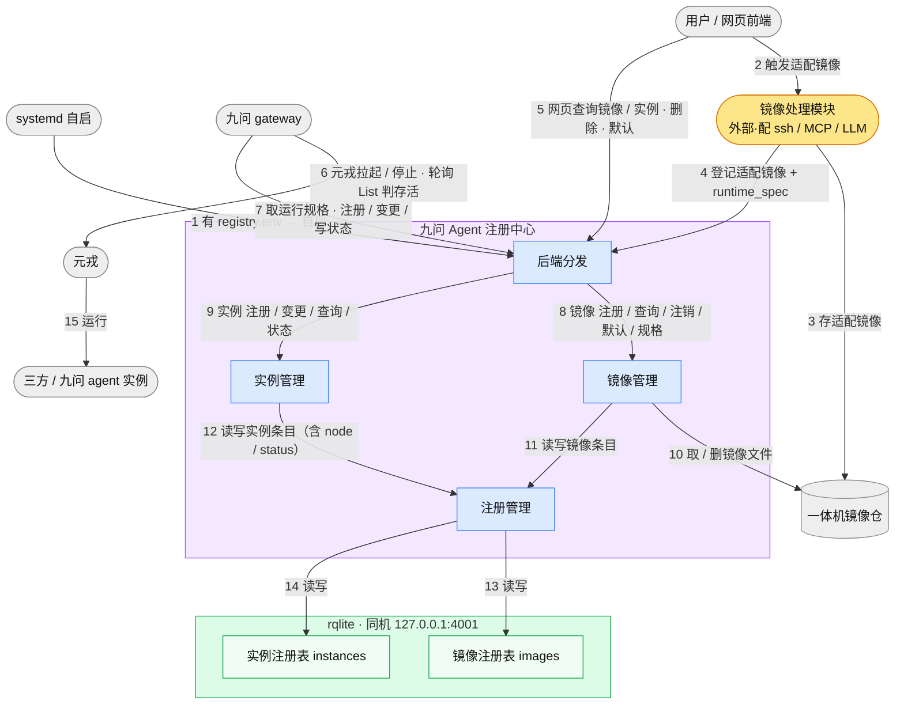
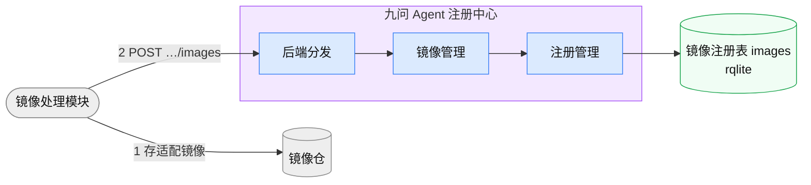
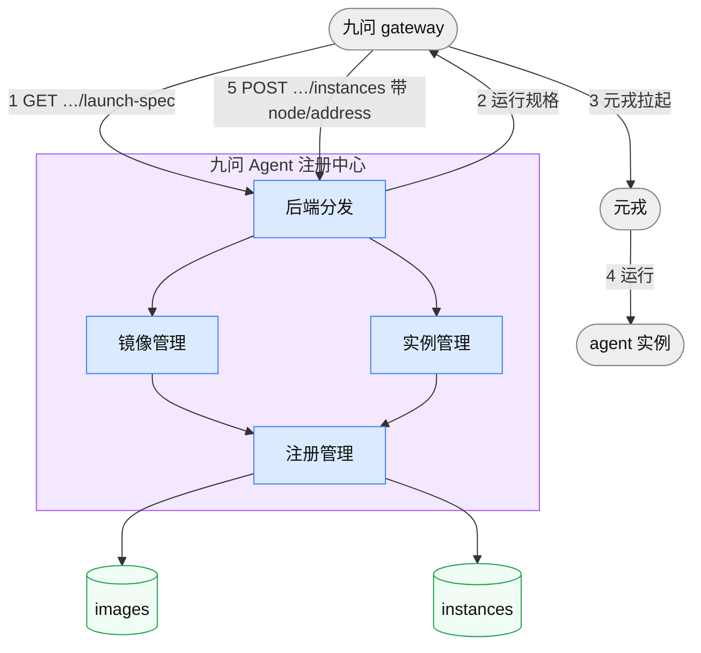
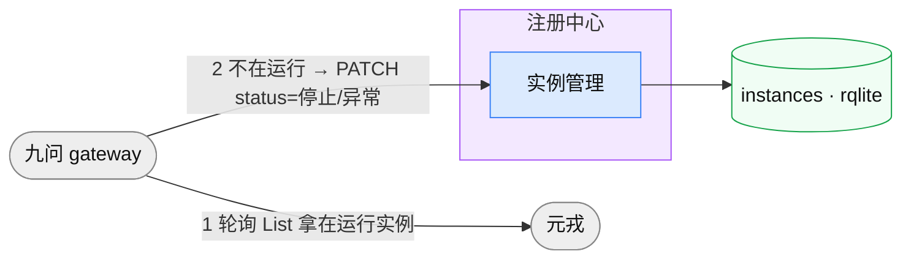
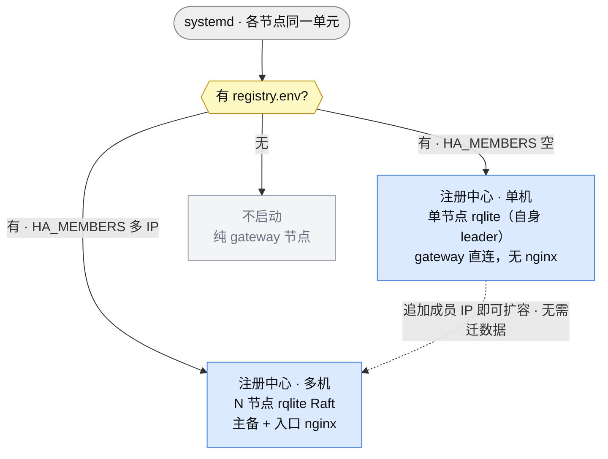
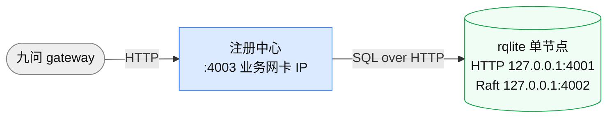
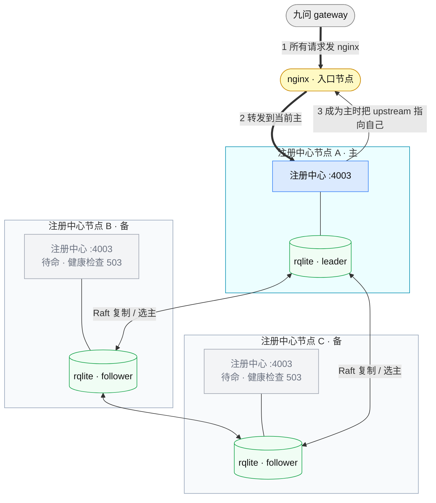

# 一体机 Agent OS registry 设计文档

> 一体机场景下，九问 Agent 注册中心负责**三方 Agent 框架镜像的管理**（注册 / 查询 / 注销 / 多版本）与 **Agent 实例的管理**（三方 / 九问）。**注册中心是纯记录方**：不调元戎、不替 gateway 决策；gateway 自行拉起 / 停止实例并把结果写入注册中心，用户经注册中心查询实例。适配镜像由**外部镜像处理模块**产出并自行登记。
>
> **存储恒为 rqlite**——单机是单节点 rqlite（自身即 leader），多机是多节点 rqlite（Raft 复制 + 选主）；不存在本地 SQLite 分支，单机扩多机不迁数据、不改代码路径。**注册中心主备跟随 rqlite 的 Raft 选主**：与 rqlite leader 同机的注册中心即为主，备只待命（健康检查返 503）。单机 gateway 直连注册中心；多机由**入口节点的一台 nginx** 转发，新主主动把 nginx 的 upstream 指向自己。
>
> 本文档写 **1 功能列表 · 2 整体视图 · 3 场景逻辑视图 · 4 注册表示例 · 5 其他材料**，描述的是**设计目标形态**；当前代码与本设计的差距见同目录 [`开发进展.md`](./开发进展.md)（当前版本 **B020**）。模块内部实现见[实现文档](./一体机Agent%20OS%20registry实现文档.md)，接口契约见 [`registry_openapi.yaml`](./registry_openapi.yaml)。

**目录**

- [1. 功能列表](#1-功能列表)
- [2. 整体视图](#2-整体视图)
- [3. 场景逻辑视图](#3-场景逻辑视图)
  - [3.1 镜像管理](#31-镜像管理)
  - [3.2 实例管理](#32-实例管理)
  - [3.3 启动与分布式](#33-启动与分布式)
- [4. 示例](#4-示例)
  - [4.1 启动配置文件](#41-启动配置文件registryenv)
  - [4.2 镜像注册表](#42-镜像注册表)
  - [4.3 实例注册表](#43-实例注册表)
- [5. 其他材料](#5-其他材料)

---

## 1. 功能列表

| 域 | 功能 | 发起方 | 说明 |
|----|------|--------|------|
| **镜像** | 镜像注册 | 镜像处理模块 | 适配镜像引用 + 元戎运行规格（`runtime_spec` 透传）登记进镜像注册表 |
| | 镜像查询 | 用户 | 列框架版本（一条目 = 一行，扁平；支持分页，一页 N 个框架版本）|
| | **取运行规格** | gateway | 拉起前查框架默认版本的元戎运行规格（`launch-spec`）|
| | 设默认版本 | 用户 | 指定某版本为默认；未设取框架版本最新 |
| | 镜像注销 | 用户 | 校验无在用实例 → 删镜像仓文件 + 删条目 |
| **实例** | **实例注册** | gateway | 自行拉起后带落点（node / address）写入注册表，`status` 初始 `运行` |
| | **实例变更** | gateway | 落点变化（元戎迁移）或**状态变化**（置 `停止` / `异常`）时更新条目 |
| | **实例注销** | **用户** | **条目不随实例停止消失**，由用户手动删除（用户面 Agent 条目，见 [§3.2](#32-实例管理)）|
| | **实例查询** | 用户 | 列实例及 `status`（`运行` / `停止` / `异常`，**落库**）；支持分页，一页 N 个实例 |
| | 存活监控 | gateway | **轮询元戎 List**（注册中心不再收心跳）：把不在运行的实例置 `停止` / `异常`（不删条目）|
| **平台** | 独立自启 | systemd | 有 `registry.env` 即起注册中心；无则该节点为纯 gateway 节点 |
| | 存储 | 注册中心 | **默认 rqlite**：单机单节点、多机多节点，同一套 SQL 与建表约束；一体机可选 etcd（规划，见 [§3.3.6](#336-存储后端rqlite-默认etcd-可选规划)）|
| | **主备** | 注册中心 | 跟随 rqlite 的 Raft 选主：与 leader 同机者为主，备健康检查返 503 |
| | **统一入口** | nginx | 多机形态下入口节点一台 nginx，新主主动把 upstream 指向自己（单机无 nginx）|
| | **组件间安全** | 平台 / 运维 | 内部组件（gateway / 管理面）经 **mTLS 双向认证**通信；注册中心**不做业务鉴权**（见 [§3.3.4](#334-端口与安全)）|
| | 客户端 SDK | gateway | httpx 长连；镜像 / 实例接口封装 |

**核心边界**：

- **注册中心不调元戎**——元戎拉起 / 停止实例由 gateway 完成；注册中心只登记 / 变更 / 查询，删除由用户发起。
- **gateway 写、用户读 + 删（实例）**——gateway 注册 / 变更 / **写状态**（`运行` / `停止` / `异常`），不查注册中心决定是否拉起（拉起前只查**镜像运行规格**）；实例查询与**删除**由用户经 UI 发起。
- **用户面 = Agent 条目**——一个 `(user, framework)` = 一个 **Agent 条目**（`service_id` 由 (user, framework) 确定性派生，天然单例）；**条目持久、不随实例停止消失**——停止 / 异常只改 `status`，删除须用户手动发起。**用户面与管理面共用同一实例注册表**。
- **运行规格对注册中心不透明**——`runtime_spec` 是**原样透传的 JSON 对象**，注册中心不解析其字段、不做结构校验；字段语义由元戎定义，随元戎接口演进而无需改注册中心。
- **注册中心单活**——主备跟随 rqlite Raft 选主，任一时刻只有与 leader 同机者对外服务（备健康检查返 503，见 [§3.3.3](#333-多机形态主备--nginx)）。

---

## 2. 整体视图

**一级模块（对应 `a2x_registry/` 文件夹）**

| 模块 | 对应代码 | 职责 |
|------|---------|------|
| **后端分发** | `backend/` | HTTP API 路由；启动时据 `registry.env` 解析监听地址与运行模式、建齐注册表 |
| **注册管理** | `register/` | 注册 / 变更 / 注销 / 查询（各命名注册表的通用 CRUD，落 rqlite）|
| **镜像管理** | `image/` | 镜像注册 / 查询 / 注销 / 多版本与默认版本 / 取运行规格 |
| **实例管理** | `instance/` | 实例注册 / 变更 / 查询 / **状态更新**（纯记录，不调元戎）|
| **注册表** | rqlite | 镜像注册表 `images` / 实例注册表 `instances`（单机单节点、多机多节点）|

> **组件间安全走 mTLS（传输层），注册中心不做业务鉴权**——不再有 `auth/` 鉴权模块与心跳模块（`heartbeat/`）；存活改由 gateway 轮询元戎驱动（见 [§3.2.5](#325-存活监控)、[§3.3.4](#334-端口与安全)）。

**外部模块**：网页前端 / 用户 · 九问 gateway · **元戎**（Docker 沙箱；**由 gateway 调用拉起 / 停止、并轮询其 List 接口做存活判定**，注册中心不调用）· 三方 / 九问 agent 实例 · 一体机镜像仓 · **镜像处理模块**（把原始镜像适配为可运行镜像**并登记进注册中心**；由用户前端触发）· **rqlite**（存储，与注册中心同机）· **nginx**（多机形态的统一入口）。



> 🟪 注册中心 / 🟦 一级模块 / 🟩 注册表 / ⬜ 外部模块 / 🟧 外部·镜像处理模块。实线箭头 = 调用；**箭头上的数字 = 步骤顺序**。上图是**单机形态**（gateway 直连注册中心）；多机形态的 nginx 与 rqlite 集群见 [§3.3.3](#333-多机形态主备--nginx)。

---

## 3. 场景逻辑视图

> 每个场景标注**外部交互接口**（方法 + 路径、输入示例、输出示例）；完整请求 / 响应 / 错误契约见 [`registry_openapi.yaml`](./registry_openapi.yaml)。镜像 / 实例为**固定命名注册表**接口（`/api/images`、`/api/instances`，不分 dataset——数据落固定的 `images` / `instances` 注册表）；ha 为全局。

**分页约定**（`GET /api/images`、`GET /api/instances` 两个列表接口共用，**参数与响应头同通用服务列表 `GET /api/datasets/{dataset}/services` 完全一致**）：

| 参数 | 类型 | 默认值 | 说明 |
|------|------|--------|------|
| `size` | int | `-1` | 分页大小；`-1` 返回全部（不分页）|
| `page` | int | `1` | 页码（从 1 开始），仅 `size>0` 时生效 |

**分页响应头**（仅 `size>0` 时设置）：`X-Total-Count`（匹配总数）· `X-Page`（当前页码）· `X-Total-Pages`（总页数）· `X-Page-Size`（当前页大小）。响应体恒为**数组**，不做 `{items, total}` 包装——分页元数据一律走 header。`size` / `page` 为**保留参数不参与过滤**（同 `include_unhealthy` / `framework` / `node` 等各接口自有的保留参数，见各场景）。

**分页单位**：两个接口**都是「一页 = N 个条目」，一条目 = 一行**，返回**扁平数组**——分页单位与存储单位同级。

| 接口 | 一页 = | `X-Total-Count` | 一元素 = |
|------|--------|-----------------|----------|
| `GET /api/instances` | N **个实例** | 过滤后的实例数 | 一个实例（实例注册表一行）|
| `GET /api/images` | N **个框架版本** | 过滤后的**版本行数** | 一个框架版本（镜像注册表一行）|

镜像**不做按框架分组的层次化返回**：镜像注册表一行 = 一个框架版本（[§4.2](#42-镜像注册表)），条目就按行扁平返回，`framework` 与 `is_default` 是行上的普通字段。这样存储、接口、分页三者同一个单位，分页是直白的 `LIMIT/OFFSET`：

```sql
-- X-Total-Count
SELECT COUNT(*) FROM image WHERE registry='images';
-- 一页
SELECT * FROM image WHERE registry='images'
ORDER BY framework ASC, version_key DESC, json_extract(data, '$.created_at') DESC
LIMIT :size OFFSET :offset;
```

> 排序把同一框架的各版本排在**相邻位置**，前端要「框架 → 版本」的树，按 `framework` 就地 group 一次即可，信息没丢。框架的版本集**可以跨页**（第 N 页页尾是 `langgraph v0.2.0`、第 N+1 页页首是 `langgraph v0.1.0`）——这是扁平分页的正常行为，不是缺陷。
>
> `created_at` 存在 `data` JSON 里（[§4.2](#42-镜像注册表)）而非独立列，故末位比较走 `json_extract`。它只在 `version_key` 相同时才起作用——即同框架下多个**版本号不合规**的条目（`version_key` 均为兜底值），量级极小，不必为它单开列或建索引。rqlite 底层即 SQLite，`json_extract` 可直接下推。

**确定序**（分页的前提，非优化项）：无全序时 `LIMIT/OFFSET` 跨页不稳定，翻页会重复或漏行，故两张表各定一个**全序**：

| 注册表 | 排序 | 说明 |
|--------|------|------|
| 镜像注册表 | `framework ASC, version_key DESC, json_extract(data,'$.created_at') DESC` | 框架名升序；框架内**新版本在前**。`is_default` **不参与排序**，只作标记 |
| 实例注册表 | `framework ASC, "user" ASC, service_id ASC` | `service_id` 是主键，兜底保证全序 |

> `version_key` 是**注册时算好并落库的规范化排序键**（[§4.2](#42-镜像注册表)），不是 `framework_version` 本身——直接按字符串排会把 `v0.10.0` 排在 `v0.2.0` 之前。之所以落库而非查询时算，是因为排序必须在 SQL 内完成才谈得上下推，而 SQL 里无法解析语义化版本号。

### 3.1 镜像管理

三方框架镜像的注册、查询、注销与多版本管理；适配镜像由外部镜像处理模块产出，注册中心只登记引用 + 元戎运行规格并检索。九问框架镜像条目随一体机预置。

#### 3.1.1 镜像注册

用户经网页触发**镜像处理模块**：把原始镜像按框架配好 ssh / MCP / LLM / liveness 探针、适配为可运行镜像、存入镜像仓；随后**镜像处理模块自行调用注册中心**登记适配镜像引用 + 元戎运行规格（经注册管理写镜像注册表）。



- **接口**：`POST /api/images`（发起方：镜像处理模块）
- **请求字段**：`framework` · `framework_version` · **`runtime_spec`（不透明 JSON，原样透传）** · `env_vars` · `workspace` · `mounts` · `image_module_version` · `uploaded_by`
- **输入示例**：
  ```json
  { "framework": "opencode", "framework_version": "v0.2.0",
    "runtime_spec": { "imageurl": "harbor.local/adapted/opencode:v0.2.0-mod1.3",
      "cpu": 1000, "memory": 2048, "ports": [ { "port": 8080, "protocol": "tcp" } ] },
    "env_vars": { "A2X_LLM_KEY": "${A2X_LLM_KEY}" },
    "workspace": "/app",
    "mounts": [ { "source": "/data/agent", "target": "/data", "readonly": false } ],
    "image_module_version": "v1.3", "uploaded_by": "user-01" }
  ```
- **输出示例**：`{ "framework": "opencode", "framework_version": "v0.2.0", "status": "registered" }`

> **`runtime_spec` 为什么是不透明对象**：其字段由元戎的沙箱 API 定义（见 [openyuanrong 官方文档](https://docs.openyuanrong.org/)），元戎接口一变字段就跟着变。注册中心只负责存取，不解析、不校验结构——这样元戎侧演进不会牵动注册中心的 schema 与代码。与之相对，`env_vars` / `workspace` / `mounts` / `image_module_version` 是**注册中心自己要用或要展示**的字段，故提到顶层。同框架多次注册按 `framework_version` 合并（同版本重发即幂等覆盖）；该框架尚无默认版本时，首次注册的版本自动成为默认。

#### 3.1.2 镜像查询

用户经网页查询镜像（经注册管理读镜像注册表）。**一条目 = 一个框架版本**（即注册表一行），返回**扁平数组**、不按框架分组。支持**分页**（`size` / `page`，同 [§3](#3-场景逻辑视图) 分页约定；**一页 = N 个框架版本**）。

- **接口**：`GET /api/images`（发起方：用户）
- **筛选参数**：`framework`（按框架）· `uploaded_by`（按上传者）；保留参数 `size` / `page` 不参与筛选
- **顺序**：`framework` 升序 → `version_key` 降序（**新版本在前**，见 [§4.2](#42-镜像注册表)）。同框架各版本因此**相邻**，前端要「框架 → 版本」的树按 `framework` 就地 group 即可。不分页（`size=-1`）时同样成立

**筛选语义**：筛选直接作用在**行**上，命中即返回该行——无分组，故不存在「框架命中但某些版本被筛掉」这类歧义。`is_default` 是行上的普通字段，跟着行走。

> 以下三例共用同一份镜像注册表快照：**12 个框架版本行**、分属 7 个框架。其中 `user-01` 上传了 4 行（`crewai` v0.4.0、`langgraph` v0.3.1、`opencode` v0.2.0 / v0.1.0）。全序为：`aider` v0.8.0 · `autogen` v0.4.0 · `claude-code` v1.0.0 / v0.9.0 · `crewai` v0.5.0 / v0.4.0 · `jiuwen-report` v1.0.0 · `langgraph` v0.3.1 / v0.2.0 / v0.1.0 · `opencode` v0.2.0 / v0.1.0。为示例简洁，各行的 `runtime_spec` 只展开 `imageurl`，`env_vars` / `workspace` / `mounts` 省略（完整字段见 [`registry_openapi.yaml`](./registry_openapi.yaml) 的 `ImageEntry`）。

**例 1 · 全列表查询**（不带 `size` → 不分页、返回全部 12 行）

```http
GET /api/images
```

```http
200 OK
（无 X-Total-Count / X-Page / X-Total-Pages / X-Page-Size —— 仅 size>0 时设置）
```

```json
[
  { "framework": "aider", "framework_version": "v0.8.0", "is_default": true,
    "runtime_spec": { "imageurl": "harbor.local/adapted/aider:v0.8.0-mod1.3" },
    "image_module_version": "v1.3", "uploaded_by": "user-02",
    "created_at": "2026-07-02T09:10:00Z" },
  { "framework": "autogen", "framework_version": "v0.4.0", "is_default": true,
    "runtime_spec": { "imageurl": "harbor.local/adapted/autogen:v0.4.0-mod1.3" },
    "image_module_version": "v1.3", "uploaded_by": "user-02",
    "created_at": "2026-07-01T10:00:00Z" },
  { "framework": "claude-code", "framework_version": "v1.0.0", "is_default": true,
    "runtime_spec": { "imageurl": "harbor.local/adapted/claude-code:v1.0.0-mod1.3" },
    "image_module_version": "v1.3", "uploaded_by": "user-02",
    "created_at": "2026-07-05T11:00:00Z" },
  { "framework": "claude-code", "framework_version": "v0.9.0", "is_default": false,
    "runtime_spec": { "imageurl": "harbor.local/adapted/claude-code:v0.9.0-mod1.2" },
    "image_module_version": "v1.2", "uploaded_by": "user-02",
    "created_at": "2026-06-30T16:40:00Z" },
  { "framework": "crewai", "framework_version": "v0.5.0", "is_default": true,
    "runtime_spec": { "imageurl": "harbor.local/adapted/crewai:v0.5.0-mod1.3" },
    "image_module_version": "v1.3", "uploaded_by": "user-02",
    "created_at": "2026-07-04T08:00:00Z" },
  { "framework": "crewai", "framework_version": "v0.4.0", "is_default": false,
    "runtime_spec": { "imageurl": "harbor.local/adapted/crewai:v0.4.0-mod1.2" },
    "image_module_version": "v1.2", "uploaded_by": "user-01",
    "created_at": "2026-06-25T13:30:00Z" },
  { "framework": "jiuwen-report", "framework_version": "v1.0.0", "is_default": true,
    "runtime_spec": { "imageurl": "harbor.local/adapted/jiuwen-report:v1.0.0-mod1.3" },
    "image_module_version": "v1.3", "uploaded_by": "system",
    "created_at": "2026-06-20T00:00:00Z" },
  { "framework": "langgraph", "framework_version": "v0.3.1", "is_default": true,
    "runtime_spec": { "imageurl": "harbor.local/adapted/langgraph:v0.3.1-mod1.3" },
    "image_module_version": "v1.3", "uploaded_by": "user-01",
    "created_at": "2026-07-07T15:05:00Z" },
  { "framework": "langgraph", "framework_version": "v0.2.0", "is_default": false,
    "runtime_spec": { "imageurl": "harbor.local/adapted/langgraph:v0.2.0-mod1.2" },
    "image_module_version": "v1.2", "uploaded_by": "user-03",
    "created_at": "2026-06-26T09:00:00Z" },
  { "framework": "langgraph", "framework_version": "v0.1.0", "is_default": false,
    "runtime_spec": { "imageurl": "harbor.local/adapted/langgraph:v0.1.0-mod1.1" },
    "image_module_version": "v1.1", "uploaded_by": "user-03",
    "created_at": "2026-06-18T09:00:00Z" },
  { "framework": "opencode", "framework_version": "v0.2.0", "is_default": true,
    "runtime_spec": { "imageurl": "harbor.local/adapted/opencode:v0.2.0-mod1.3" },
    "image_module_version": "v1.3", "uploaded_by": "user-01",
    "created_at": "2026-07-06T10:00:00Z" },
  { "framework": "opencode", "framework_version": "v0.1.0", "is_default": false,
    "runtime_spec": { "imageurl": "harbor.local/adapted/opencode:v0.1.0-mod1.1" },
    "image_module_version": "v1.1", "uploaded_by": "user-01",
    "created_at": "2026-06-28T14:20:00Z" }
]
```

> 12 个元素（每元素 = 一行）。同框架各版本相邻且**新版本在前**（`claude-code` v1.0.0 先于 v0.9.0、`langgraph` v0.3.1 → v0.2.0 → v0.1.0）。每框架恰有一行 `is_default: true`。

**例 2 · 分页列表查询**（一页 4 行，取第 2 页）

```http
GET /api/images?size=4&page=2
```

```http
200 OK
X-Total-Count: 12      # 框架版本行总数
X-Page: 2
X-Total-Pages: 3       # ceil(12 / 4)
X-Page-Size: 4
```

```json
[
  { "framework": "crewai", "framework_version": "v0.5.0", "is_default": true,
    "runtime_spec": { "imageurl": "harbor.local/adapted/crewai:v0.5.0-mod1.3" },
    "image_module_version": "v1.3", "uploaded_by": "user-02",
    "created_at": "2026-07-04T08:00:00Z" },
  { "framework": "crewai", "framework_version": "v0.4.0", "is_default": false,
    "runtime_spec": { "imageurl": "harbor.local/adapted/crewai:v0.4.0-mod1.2" },
    "image_module_version": "v1.2", "uploaded_by": "user-01",
    "created_at": "2026-06-25T13:30:00Z" },
  { "framework": "jiuwen-report", "framework_version": "v1.0.0", "is_default": true,
    "runtime_spec": { "imageurl": "harbor.local/adapted/jiuwen-report:v1.0.0-mod1.3" },
    "image_module_version": "v1.3", "uploaded_by": "system",
    "created_at": "2026-06-20T00:00:00Z" },
  { "framework": "langgraph", "framework_version": "v0.3.1", "is_default": true,
    "runtime_spec": { "imageurl": "harbor.local/adapted/langgraph:v0.3.1-mod1.3" },
    "image_module_version": "v1.3", "uploaded_by": "user-01",
    "created_at": "2026-07-07T15:05:00Z" }
]
```

> 全序里的第 5–8 行。注意 `langgraph` 的 3 个版本**跨页**：v0.3.1 落在本页页尾，v0.2.0 / v0.1.0 在第 3 页——扁平分页下这是正常行为。

**例 3 · 分页列表 + 按用户筛选**（`user-01` 上传的镜像，一页 2 行，第 1 页）

```http
GET /api/images?uploaded_by=user-01&size=2&page=1
```

```http
200 OK
X-Total-Count: 4       # 筛选后的行数（crewai v0.4.0、langgraph v0.3.1、opencode v0.2.0 / v0.1.0）
X-Page: 1
X-Total-Pages: 2       # ceil(4 / 2)
X-Page-Size: 2
```

```json
[
  { "framework": "crewai", "framework_version": "v0.4.0", "is_default": false,
    "runtime_spec": { "imageurl": "harbor.local/adapted/crewai:v0.4.0-mod1.2" },
    "image_module_version": "v1.2", "uploaded_by": "user-01",
    "created_at": "2026-06-25T13:30:00Z" },
  { "framework": "langgraph", "framework_version": "v0.3.1", "is_default": true,
    "runtime_spec": { "imageurl": "harbor.local/adapted/langgraph:v0.3.1-mod1.3" },
    "image_module_version": "v1.3", "uploaded_by": "user-01",
    "created_at": "2026-07-07T15:05:00Z" }
]
```

> 筛选只挑命中的**行**：`crewai` 只回 v0.4.0（v0.5.0 是 user-02 传的，不返回），`is_default: false` 如实反映该行不是默认版本——不存在框架级字段与行级字段打架的问题。第 2 页为 `opencode` v0.2.0 / v0.1.0。

#### 3.1.3 取运行规格

gateway 拉起实例**前**查此拿元戎运行规格；不带 `version` 取框架默认版本。镜像管理据默认版本组合返回。

- **接口**：`GET /api/images/{framework}/launch-spec`（发起方：gateway）
- **输入示例**：`GET …/images/opencode/launch-spec`（可选 `?version=v0.2.0`）
- **输出示例**：
  ```json
  { "framework": "opencode", "framework_version": "v0.2.0",
    "runtime_spec": { "imageurl": "harbor.local/adapted/opencode:v0.2.0-mod1.3",
      "cpu": 1000, "memory": 2048, "ports": [ { "port": 8080, "protocol": "tcp" } ] },
    "env_vars": { "A2X_LLM_KEY": "${A2X_LLM_KEY}" },
    "workspace": "/app",
    "mounts": [ { "source": "/data/agent", "target": "/data", "readonly": false } ],
    "image_module_version": "v1.3" }
  ```
  > 均为**镜像级**字段，与 `POST /api/images` 登记时的形状一致（`runtime_spec` 原样返回）；gateway 拉起时再补**实例级**字段（`sandbox_type` / `host_user`=user / `name`=service_id / `lifecycle` / `idle_timeout`）。框架无默认版本时回退到 `version_key` 最大（最新）的一版。

#### 3.1.4 设默认版本 / 3.1.5 镜像注销

- **设默认版本**：`PUT /api/images/{framework}/default`（用户）。输入 `{ "framework_version": "v0.2.0" }` → 输出 `{ "framework": "opencode", "default": "v0.2.0", "status": "updated" }`。每框架恰有一行 `is_default=1`，改默认即「旧默认清零 + 新默认置一」。
- **镜像注销**：`DELETE /api/images/{framework}/{version}`（用户）。**先校验无在用实例**（查实例注册表的 `framework` + `framework_version`），无则删镜像仓文件 + 删该版本条目；有在用则 `409`（响应体带 `code: image_in_use` 与在用实例列表）。删掉的若是默认版本，则把剩余版本中最新的一版自动提升为默认。输出 `{ "framework": "opencode", "framework_version": "v0.2.0", "status": "deregistered" }`。

### 3.2 实例管理

Agent 实例（三方 / 九问）的注册 / 变更 / 查询 / **状态更新**，以及**用户手动删除**。**gateway 自行决定是否拉起**（不查注册中心）：拉起前经 [§3.1.3](#313-取运行规格) 取运行规格 → 自行调元戎拉起 → 向注册中心**注册**（`status` 初始 `运行`）；落点变化时**变更**；停止 / 异常时把 `status` 置 `停止` / `异常`（**不删条目**，见 [§3.2.5](#325-存活监控)）。**用户**查询实例、并手动**删除**不再需要的 Agent 条目。三方与九问同一套流程，仅九问框架镜像条目预置。**注册中心不调元戎**，是纯记录方。

#### 3.2.1 实例注册

gateway 取运行规格 → 自行调元戎拉起、取落点 node / address → 向实例管理注册（写条目）。



本场景用到**两个接口**：先取运行规格（步骤 1），再注册实例（步骤 5）。

**接口 ①（步骤 1）取运行规格**：`GET /api/images/{framework}/launch-spec`（发起方：gateway；同 [§3.1.3](#313-取运行规格)）

**接口 ②（步骤 5）注册实例**：`POST /api/instances`（发起方：gateway）

- **必填字段**：`service_id` · `kind` · `framework` · `framework_version` · `node` · `address` · `user`
- **输入示例**：
  ```json
  { "service_id": "generic_3f9a1b2c", "kind": "三方", "framework": "opencode",
    "framework_version": "v0.2.0", "node": "192.168.0.12",
    "address": "10.244.1.7:4096", "user": "user-01" }
  ```
- **输出示例**：
  ```json
  { "service_id": "generic_3f9a1b2c", "kind": "三方", "framework": "opencode",
    "framework_version": "v0.2.0", "address": "10.244.1.7:4096",
    "node": "192.168.0.12", "user": "user-01",
    "created_at": "2026-07-06T10:00:00Z", "last_active_at": "2026-07-06T10:00:00Z",
    "status": "运行" }
  ```
  > `service_id` 幂等：同 `service_id` 重发即 upsert 覆盖，`created_at` 保留首次值。`kind` 只接受 `三方` / `九问`，其余值 `400`。

#### 3.2.2 实例变更 / 状态更新

gateway 在落点变化（元戎迁移，`node` / `address` 改变）或**存活状态变化**（置 `停止` / `异常`，见 [§3.2.5](#325-存活监控)）时更新条目；`service_id` 不变。

- **接口**：`PATCH /api/instances/{service_id}`（发起方：gateway）
- **可改字段**：`node` / `address` / `status`（至少给一个，否则 `400`；`status` 只接受 `运行` / `停止` / `异常`）
- **输入示例**：`{ "status": "停止" }` 或 `{ "node": "192.168.0.20", "address": "10.244.3.9:4096" }`
- **输出示例**：`{ "service_id": "generic_3f9a1b2c", "kind": "三方", "framework": "opencode", "framework_version": "v0.2.0", "address": "10.244.1.7:4096", "node": "192.168.0.12", "user": "user-01", "status": "停止" }`

#### 3.2.3 实例删除（用户手动）

Agent 条目**不随实例停止消失**：gateway 停 / 检测到异常只把 `status` 置 `停止` / `异常`（[§3.2.5](#325-存活监控)），条目仍在。删除**由用户经 UI 手动发起**。

- **接口**：`DELETE /api/instances/{service_id}`（发起方：**用户**）
- **输入示例**：`DELETE …/instances/generic_3f9a1b2c`
- **输出示例**：`{ "service_id": "generic_3f9a1b2c", "deleted": true }`（幂等：已删则 `deleted: false`）

#### 3.2.4 实例查询

用户经 UI 查实例及 `status`（**落库字段**，`运行` / `停止` / `异常`）。**默认只回 `运行`**；带 `?include_unhealthy=true` 才把 `停止` / `异常` 一并返回（接口与参数**保持不变**，仅「非运行」集合由原来的 `异常` 扩为 `停止` + `异常`）。可按 `node` / `framework` / `kind` / `user` 过滤（`?user=<ID>` 查某用户的实例）。支持**分页**（`size` / `page`，同 [§3](#3-场景逻辑视图) 分页约定；**一页 = N 个实例**）。

- **接口**：`GET /api/instances`（发起方：用户 / 管理面）
- **筛选参数**：`node` / `framework` / `kind` / `user`；保留参数 `size` / `page` / `include_unhealthy` 不参与筛选
- **顺序**：`framework` 升序 → `user` 升序 → `service_id` 升序（主键兜底，保证全序）
- **过滤与分页的先后**：先按过滤条件（含 `include_unhealthy` 决定的状态可见性）筛出全集，再对结果分页，故 `X-Total-Count` 是**过滤后**的总数。`include_unhealthy=false` 下推成 SQL 的 `status = '运行'`，计数与翻页都在库里完成

> 以下两例共用同一份实例注册表快照：**6 个实例**，其中 `langgraph` / `user-03` 那个 gateway 已置 `停止`（元戎 List 显示其已不在运行），其余 5 个 `运行`。`user-01` 有 3 个实例（`aider` / `crewai` / `opencode`——每用户每框架一个 Agent 条目）。

**例 1 · 实例列表查询**（不带 `size` → 不分页；不带 `include_unhealthy` → **只回 `运行`**）

```http
GET /api/instances
```

```http
200 OK
（无分页响应头 —— 仅 size>0 时设置）
```

```json
[
  { "service_id": "generic_1a04c7d3", "kind": "三方", "framework": "aider",
    "framework_version": "v0.8.0", "node": "192.168.0.12",
    "address": "10.244.1.5:4096", "user": "user-01", "status": "运行",
    "created_at": "2026-07-06T09:30:00Z", "last_active_at": "2026-07-06T10:41:00Z" },
  { "service_id": "generic_5b2c8e1f", "kind": "三方", "framework": "crewai",
    "framework_version": "v0.5.0", "node": "192.168.0.12",
    "address": "10.244.1.6:4096", "user": "user-01", "status": "运行",
    "created_at": "2026-07-06T09:45:00Z", "last_active_at": "2026-07-06T10:42:00Z" },
  { "service_id": "generic_9c21ab55", "kind": "九问", "framework": "jiuwen-report",
    "framework_version": "v1.0.0", "node": "192.168.0.11",
    "address": "10.244.2.3:8080", "user": "user-02", "status": "运行",
    "created_at": "2026-07-06T08:00:00Z", "last_active_at": "2026-07-06T10:42:00Z" },
  { "service_id": "generic_3f9a1b2c", "kind": "三方", "framework": "opencode",
    "framework_version": "v0.2.0", "node": "192.168.0.12",
    "address": "10.244.1.7:4096", "user": "user-01", "status": "运行",
    "created_at": "2026-07-06T10:00:00Z", "last_active_at": "2026-07-06T10:42:00Z" },
  { "service_id": "generic_a18d40e9", "kind": "三方", "framework": "opencode",
    "framework_version": "v0.2.0", "node": "192.168.0.11",
    "address": "10.244.2.9:4096", "user": "user-04", "status": "运行",
    "created_at": "2026-07-06T10:15:00Z", "last_active_at": "2026-07-06T10:42:00Z" }
]
```

> 5 个元素——`langgraph` / `user-03` 那个 `停止` 实例**未返回**（默认只回 `运行`；要看它须带 `?include_unhealthy=true`）。排序：`aider` → `crewai` → `jiuwen-report` → `opencode`，`opencode` 内 `user-01` 先于 `user-04`。

**例 2 · 分页列表 + 按用户筛选**（`user-01` 的实例，一页 2 个，取第 2 页）

```http
GET /api/instances?user=user-01&size=2&page=2
```

```http
200 OK
X-Total-Count: 3       # 筛选后（user-01 且 运行）的实例数
X-Page: 2
X-Total-Pages: 2       # ceil(3 / 2)
X-Page-Size: 1         # 本页实际条数
```

```json
[
  { "service_id": "generic_3f9a1b2c", "kind": "三方", "framework": "opencode",
    "framework_version": "v0.2.0", "node": "192.168.0.12",
    "address": "10.244.1.7:4096", "user": "user-01", "status": "运行",
    "created_at": "2026-07-06T10:00:00Z", "last_active_at": "2026-07-06T10:42:00Z" }
]
```

> 第 1 页是 `aider` / `crewai` 两个，第 2 页只剩 `opencode` 一个。`X-Total-Count: 3` 是**过滤后**的数（全表 6 个、`运行` 5 个、`user-01` 且 `运行` 3 个）——若带 `?include_unhealthy=true` 且 user-01 有 `停止` / `异常` 实例，这个数会随之变大。

#### 3.2.5 存活监控

注册中心**不再接收心跳、不再自行派生或剔除**。实例存活由 **gateway 主动驱动**：

- gateway **周期轮询元戎 List 接口**（[yuanrong#358](https://gitcode.com/openeuler/yuanrong/issues/358)）拿到「当前实际在运行的实例」，与注册中心实例列表比对；
- 对**已不在运行**的实例，gateway 调 `PATCH …/instances/{service_id}` 把 `status` 置为 **`停止`**（gateway 主动关停）或 **`异常`**（检测到非正常退出）——**保留条目、不删除**；恢复运行则置回 `运行`。
- **删除只由用户手动发起**（`DELETE …/instances/{service_id}`，[§3.2.3](#323-实例删除用户手动)）。

即 `status` 是**落库的普通可改字段**（[§4.3](#43-实例注册表)），由 gateway 写入；注册中心既不派生、也不做超时自动剔除。



> **相对旧版的变化**：旧版为「gateway 按 node 发心跳 → 注册中心租约超 TTL 派生 `异常`、超宽限**自动删**该 node 实例」，`status` 查询时派生。现按需求改为 **gateway 据元戎 List 显式改 `status`、条目持久**；心跳 / 租约机制及 `POST /api/nodes/{node}/heartbeat`、`GET/POST /api/lease-config` 接口**从契约移除**，`heartbeat/` 模块下线。因不再有内存租约，「注册中心必须单活」也不再由心跳引起（仅剩 rqlite 选主一处，见 [§3.3.3](#333-多机形态主备--nginx)）。

### 3.3 启动与分布式

#### 3.3.1 启动（registry.env）

注册中心的**唯一启动配置**是 `/etc/a2x-registry/registry.env`：

- **有 `registry.env`** → systemd 起注册中心（`ConditionPathExists`）；注册中心读其字段决定**监听地址 / 端口 / 运行模式 / rqlite 端点 / 成员集**（字段表与完整示例见 [§4.1](#41-启动配置文件registryenv)）。启动命令**不含任何监听 IP**。
- **无 `registry.env`** → systemd **不起注册中心**（该节点为纯 gateway 节点）。
- **启动模式 `A2X_REGISTRY_MODE`** 决定建哪些表：`appliance`（一体机）→ **启动时**建**镜像注册表 + 实例注册表**（连同通用服务注册表）；空 / 其他 → **只建服务注册表**、不建镜像 / 实例表，`/api/images` 与 `/api/instances` 返回 404。
- **所有所需表在启动时一次性建齐**（`CREATE TABLE IF NOT EXISTS`）——rqlite 不适合在运行时动态建表（每条 DDL 都是一次 Raft 提交），故须启动时预先建好；单机 / 多机一致。



- **接口（非 REST）**：`a2x-registry`（由 systemd `ExecStart` 拉起，`ConditionPathExists=/etc/a2x-registry/registry.env`）
- **输入示例**：`registry.env`（各形态的完整文件见 [§4.1](#41-启动配置文件registryenv)）
- **输出示例**：进程监听 `192.168.0.11:4003`，连本机 rqlite `http://127.0.0.1:4001`；`HA_MEMBERS` 空则单机、多 IP 则参与主备

#### 3.3.2 单机形态

一台机器上：注册中心 + 单节点 rqlite。rqlite 自身即 leader，注册中心自然就是主，**没有备、没有 nginx**，gateway 直连注册中心的 `4003`。



单机之所以也用 rqlite（而非本地 SQLite 文件），是为**扩容不改一行代码、不迁一条数据**：单节点与多节点走同一套 SQL 方言、同一套建表约束、同一条访问路径（HTTP `127.0.0.1:4001`），扩容只是往 `registry.env` 的 `A2X_REGISTRY_HA_MEMBERS` 里追加成员 IP 并让 rqlite 组集群。

#### 3.3.3 多机形态（主备 + nginx）

用户在 agentos 部署时**指定哪些节点作注册中心节点**；每个被指定的节点上都是「注册中心 + rqlite」成对部署。

**成员数须为奇数**（Raft 靠多数派选主，偶数不增加容错还多一票）。**若用户给了偶数个，自动去掉最后一个并告警**——例如给 4 个则实际生效前 3 个。

**主备如何确定**：注册中心**不自己选举**，直接复用 rqlite 的 Raft 结果——周期查本机 rqlite 的状态，判断本机是否为 Raft leader：

| 角色 | 判定 | 行为 |
|------|------|------|
| **主** | 本机 rqlite 是 Raft leader | 正常服务；把入口 nginx 的 upstream 指向自己 |
| **备** | 本机 rqlite 是 follower | 待命；健康检查返 `503`，不接业务流量 |

> **为什么单活**：主备共用同一份 rqlite，写都经 Raft 汇到 leader，一致性由 rqlite 保证。备返 `503` 是为了让 gateway / nginx 有**唯一确定的服务端**、避免双入口与状态歧义（心跳移除后已无「备误删实例」的数据安全风险，见 [§3.2.5](#325-存活监控)）。
>
> **切主无观察窗**：`status` 落库（rqlite），主备切换 / 重启后实例状态照常保留、无需重建——这是移除内存心跳租约后的直接收益。

**入口**：**固定入口节点上部署一台 nginx**，gateway 一律把请求发往它。主注册中心在成为主时，**主动把该 nginx 的 upstream 改写成指向自己**并触发 reload；主故障切换后，新主重新改写。nginx 只做转发，gateway 端始终是同一个稳定地址。



- **接口**：`GET /api/ha/leader`（当前主地址，任一节点据本机 rqlite 的 Raft 状态回主）；`GET/POST /api/ha/members`（查看 / 变更成员集，偶数去尾 + 告警）
- **输入示例**：`GET /api/ha/leader`
- **输出示例**：`{ "leader": "192.168.0.11" }`

> **rqlite 的读写不需要注册中心感知主**：rqlite 的 follower 收到写请求会经节点间通道转发给 leader，读同理。所以注册中心恒连**本机** `127.0.0.1:4001` 即可，选主对存储访问是透明的。注册中心之所以还要知道谁是主，**只是为了决定自己是否该对外服务**（备返 503，见上）。

#### 3.3.4 端口与安全

| 服务 | 端口 | 单机绑定 | 多机绑定 | 对谁开放 |
|------|------|---------|---------|---------|
| nginx（入口） | **4000** | — | 入口节点业务网卡 IP | gateway / 用户 |
| 注册中心 backend | **4003** | 业务网卡 IP | 业务网卡 IP | 单机：gateway 直连；多机：nginx |
| rqlite HTTP | **4001** | `127.0.0.1` | `127.0.0.1` | 仅本机注册中心 |
| rqlite Raft | **4002** | `127.0.0.1` | **业务网卡 IP** | 仅集群内其它 rqlite 节点 |

> 端口归到 `400x` 段，与一体机其它模块（yuanrong `31182` / `8888`、jiuwenswarm `8888`）不冲突。注册中心**不允许绑 `0.0.0.0`**：要么 `127.0.0.1`，要么显式的业务网卡 IP（不铺到公网 / 管理口）。

**安全要点**：

1. **rqlite HTTP（4001）恒绑 `127.0.0.1`** —— SQL 接口不出本机，集群外部无法直连数据库。这不受多机影响：rqlite 的节点间 join / 复制 / 写转发全部走 **Raft 口 4002**，不走 4001。
2. **rqlite Raft（4002）多机时必须绑业务网卡** —— 否则组不成集群。风险是**任何能连上 4002 的人都能加入集群并拉走全量数据**，故必须双重防护：
   - **防火墙白名单**：4002 只放行集群内注册中心节点的 IP。
   - **节点间 TLS**：启用 rqlite 的节点间加密（CA + 证书 + 私钥），必要时开双向校验。
3. **注册中心 4003 走 mTLS 双向认证** —— 内部组件（gateway / 管理面 / 镜像处理模块）与注册中心之间用 **mTLS**（配置内部 CA 签发的证书即启用，未配则纯 http），由传输层双向校验组件身份**替代业务层鉴权**（注册中心不做 token / API Key 门控）。多机形态下 4003 绑业务网卡（nginx 需跨机转发到主，不能绑 `127.0.0.1`），有 mTLS 兜底不会裸奔。证书 / CA 由平台统一签发下发。
4. **rqlite HTTP 若确需跨机暴露** —— 须同时开 rqlite 的用户鉴权与 HTTPS，注册中心侧用 `A2X_REGISTRY_DB_AUTH`（`user:pwd`）携带凭据。默认形态不需要。

#### 3.3.5 agentos 部署

注册中心以 **`agent-gateway`** 模块接入一体机 agentos 统一部署框架。agentos 分**构建**与**部署**两阶段：

```
build.sh（构建机，联网）                       agentos.sh（目标机）
  下载各组件包 ──打包──▶ AgentOS-Server-<arch>.tgz ──解压──▶ install → up
```

**构建阶段** `build/build.sh`：下载注册中心 wheel（`a2x_registry-*-py3-none-any.whl`，架构无关）与 rqlite rpm（分架构，`x86_64` / `aarch64`）到 `downloads/agent-gateway/`，随 server 包一起打进 `AgentOS-Server-<arch>.tgz`。

**部署阶段** `deploy/agentos.sh`：`MODULES` 数组中 `agent-gateway` 位于 `yuanrong` 之后、`jiuwenswarm` 之前（gateway 运行期要写注册中心，故注册中心先起）。调度逻辑不动，模块只实现 4 个钩子：

| 钩子 | 做什么 |
|------|--------|
| `agent-gateway_install` | 从 `AGENTOS_ROOT` 装 rqlite rpm（系统级，自带 `rqlited.service`）+ pip 装注册中心 whl；生成 `agent-registry.service`（`Requires` / `After=rqlited.service`，`Restart=on-failure` + 重启熔断）；`systemctl daemon-reload` |
| `agent-gateway_up` | 解析 `BIND`（`--hosts` 首个 IP，未给则本机网卡首个非回环 IP）→ 写 `registry.env` → `systemctl enable --now rqlited agent-registry` → curl 健康检查就绪后返回 |
| `agent-gateway_down` | `systemctl disable --now agent-registry rqlited`（systemd 依赖保证注册中心先于 rqlited 停）|
| `agent-gateway_uninstall` | 停服务 → 删 unit 与 `registry.env` → pip 卸 whl → `rpm -e rqlite` |

> 两个服务都由 **systemd** 托管：`rqlited.service`（rqlite rpm 自带）与 `agent-registry.service`（install 钩子生成）。注册中心 unit 声明 `Requires` / `After=rqlited.service`，启动顺序交给 systemd；`systemctl start` 不等 uvicorn 真就绪，故 `up` 钩子仍需 curl 探测健康。
>
> **多机部署**在此基础上追加两件事：① 各注册中心节点的 rqlited 配置成集群（Raft 绑业务网卡 + 互相 join）；② 入口节点部署 nginx。

#### 3.3.6 存储后端（rqlite 默认，etcd 可选·规划）

默认存储恒为 rqlite（本文全篇形态）。为一体机复用元戎 etcd，规划一个**可选 etcd 后端**：把 image / instance 用到的表操作抽象为 `TableRepo` 接口（依赖倒置，8 个原语），rqlite 与 etcd 各实现，按 `A2X_REGISTRY_DB_KIND` 选择。**两后端行为一致**（etcd 全实现，含分页 / 筛选）；组合逻辑（`set_default` 等）收在 service 层。隔离用 key 前缀（**无 RBAC**），传输用证书驱动的可选 mTLS。详见 [`ETCD兼容分析.md`](./ETCD兼容分析.md)。**是否落地待定。**

---

## 4. 示例

### 4.1 启动配置文件（registry.env）

`/etc/a2x-registry/registry.env` 是注册中心的**唯一启动配置**：systemd `ConditionPathExists` 据其**存在与否**决定是否起注册中心；注册中心读其字段决定运行模式、监听地址与存储端点。**启动命令 `a2x-registry` 不含任何监听 IP**（`ExecStart=/usr/bin/a2x-registry`）。

| 字段 | 含义 | 空 / 未设 |
|------|------|-----------|
| `A2X_REGISTRY_MODE` | **启动模式**（决定建哪些注册表）| 空 → 通用（**仅**服务注册表）；`appliance` → 一体机（**另建**镜像 / 实例注册表）|
| `A2X_REGISTRY_BIND` | **监听地址**（业务网卡 IP）| 空 → `127.0.0.1`；**禁 `0.0.0.0`** |
| `A2X_REGISTRY_PORT` | 监听端口 | 空 → `8000`；一体机部署固定 `4003` |
| `A2X_REGISTRY_DB_KIND` | 存储后端 | **恒为 `rqlite`**（保留字段；`memory` 仅供开发调试）|
| `A2X_REGISTRY_DB_ENDPOINT` | **本机 rqlite HTTP 端点** | 空 → `http://127.0.0.1:4001` |
| `A2X_REGISTRY_DB_AUTH` | rqlite basic auth（`user:pwd`）| 空 → 不带认证（HTTP 绑 `127.0.0.1` 时的默认形态）|
| `A2X_REGISTRY_HA_MEMBERS` | **注册中心成员集**（逗号分隔 IP，**须含本机 IP**）| 空 → **单机**（无主备、无 nginx）；**多 IP** → **多机主备**（须奇数，偶数自动去尾 + 告警）|
| `A2X_REGISTRY_NGINX` | 入口 nginx 节点地址 | 空 → 不做 upstream 改写（单机形态）|

> 不允许 `0.0.0.0`：单机绑业务网卡供 gateway 直连；多机同样绑业务网卡（nginx 需跨机转发到当前主，绑回环则打不到）。安全由 [§3.3.4](#334-端口与安全) 的 mTLS + 防火墙保证。

**各形态的完整 `registry.env`**：

**① 单机**（注册中心 + 单节点 rqlite，gateway 直连 `192.168.0.11:4003`）

```ini
# /etc/a2x-registry/registry.env
A2X_REGISTRY_MODE=appliance
A2X_REGISTRY_BIND=192.168.0.11
A2X_REGISTRY_PORT=4003
A2X_REGISTRY_DB_KIND=rqlite
A2X_REGISTRY_DB_ENDPOINT=http://127.0.0.1:4001
A2X_REGISTRY_HA_MEMBERS=
A2X_REGISTRY_NGINX=
```

**② 多机 · 成员节点**（三节点主备，本机为 `192.168.0.12`；入口 nginx 在 `192.168.0.11`）

```ini
# /etc/a2x-registry/registry.env
A2X_REGISTRY_MODE=appliance
A2X_REGISTRY_BIND=192.168.0.12
A2X_REGISTRY_PORT=4003
A2X_REGISTRY_DB_KIND=rqlite
A2X_REGISTRY_DB_ENDPOINT=http://127.0.0.1:4001
A2X_REGISTRY_HA_MEMBERS=192.168.0.11,192.168.0.12,192.168.0.13
A2X_REGISTRY_NGINX=192.168.0.11:4000
```

> 三个成员节点的 `registry.env` **只有 `A2X_REGISTRY_BIND` 不同**，`HA_MEMBERS` 与 `NGINX` 完全一致。谁是主由 rqlite 的 Raft 选举决定，不在配置里指定。
>
> 从 ① 扩到 ②：把 `HA_MEMBERS` 填上三个 IP、配好 nginx，并让各节点 rqlited 组集群即可——**不迁数据、不改代码路径**，因为单机本来就是 rqlite。

**③ 纯 gateway 节点**：**不放** `registry.env` 文件 → systemd `ConditionPathExists` 不命中 → 不起注册中心。

### 4.2 镜像注册表

**注册表 `images`**（kind=image，物理表 `image`）：**一行 = 一个框架版本**（`framework` + `framework_version`）；`is_default` 标记该框架默认版本。

| 列 | 角色 | 说明 |
|----|------|------|
| `registry` | 主键 | 恒为 `images` |
| `service_id` | 主键 | `image_sid(framework, framework_version)` = `image_` + sha256(`framework\|version`)[:16] |
| `framework` | **热查列**（索引）| 按框架查 |
| `framework_version` | **热查列**（索引）| 按版本查 |
| `version_key` | **排序列**（索引）| `framework_version` 的**规范化排序键**，注册时算好落库；框架内按其**降序**排（新版本在前）|
| `is_default` | **热查列** | `1` = 该框架默认版本（每框架恰一行 = 1）。**不参与排序** |
| `uploaded_by` | **热查列**（索引）| 登记该版本的用户 ID（`POST /api/images` 的 `uploaded_by`）；供**按上传者筛选**。九问预置条目为 `system` |
| `data` | JSON | `{runtime_spec, env_vars, workspace, mounts, image_module_version, created_at}`——`runtime_spec` 为**原样透传的不透明对象** |

**`version_key` 派生规则**（注册时一次算好，之后只读）：

| `framework_version` | `version_key` | 说明 |
|---|---|---|
| `v0.2.0` | `00000.00002.00000~` | 匹配 `v?<major>.<minor>.<patch>` → 各段补零到 5 位 |
| `v0.10.0` | `00000.00010.00000~` | 补零后 `00010 > 00002`，正确排在 `v0.2.0` **之前** |
| `v0.2.0-beta` | `00000.00002.00000-beta` | 预发布版；正式版尾缀 `~`（ASCII `0x7E`，大于任何字母与 `-`），故降序时**正式版排在同号预发布版之前** |
| `nightly`（不合规）| `00000.00000.00000` | 解析失败兜底 → 排在该框架所有合规版本**之后**，组内按 `created_at` 降序 |

**示例行**（opencode 两版本）：

| service_id | framework | framework_version | version_key | is_default | uploaded_by |
|---|---|---|---|---|---|
| `image_7c2a…` | opencode | v0.2.0 | `00000.00002.00000~` | 1 | user-01 |
| `image_9b3f…` | opencode | v0.1.0 | `00000.00001.00000~` | 0 | user-01 |

其中 `data`（v0.2.0）：

```json
{ "runtime_spec": { "imageurl": "harbor.local/adapted/opencode:v0.2.0-mod1.3",
    "cpu": 1000, "memory": 2048, "ports": [ { "port": 8080, "protocol": "tcp" } ] },
  "env_vars": { "A2X_LLM_KEY": "${A2X_LLM_KEY}" },
  "workspace": "/app",
  "mounts": [ { "source": "/data/agent", "target": "/data", "readonly": false } ],
  "image_module_version": "v1.3",
  "created_at": "2026-07-06T10:00:00Z" }
```

> **三种查询**：① framework → 默认版本 `WHERE framework=? AND is_default=1`；② framework+version `WHERE framework=? AND framework_version=?`；③ 全部（`GET /api/images`）**扁平返回**，一条目 = 一行（`framework` / `is_default` 是行上的普通字段，不做框架分组），`ORDER BY framework ASC, version_key DESC` + `LIMIT/OFFSET`——确定序见 [§3](#3-场景逻辑视图) 分页约定。`runtime_spec` 的内容对应**元戎 Docker 沙箱**（见 [openyuanrong 官方文档](https://docs.openyuanrong.org/)），注册中心不解析；gateway 经 **`GET …/launch-spec`**（[§3.1.3](#313-取运行规格)）拿组合规格，实例级字段拉起时拼接。表结构与索引见实现文档。

### 4.3 实例注册表

**注册表 `instances`**（kind=instance，物理表 `instance`）：一行 = 一个 **Agent 条目**，`service_id` 由 **(user, framework) 确定性派生**（每用户每框架**一个条目**）。**条目持久**——停止 / 异常只改 `status`，删除须用户手动发起。**用户面与管理面共用此表**。

| 列 | 角色 | 说明 |
|----|------|------|
| `registry` | 主键 | 恒为 `instances` |
| `service_id` | 主键 | `instance_sid(user, framework)` = `generic_` + sha256(`user\|framework`)[:8] |
| `kind` | **热查列** | `三方` / `九问`（`?kind` 过滤）|
| `status` | **热查列**（**落库**）| `运行` / `停止` / `异常`——由 **gateway 写入**（据元戎 List），注册中心不派生；`include_unhealthy=false` 时下推 `status='运行'` |
| `framework` / `framework_version` | **热查列**（索引）| 镜像在用校验 |
| `node` | **热查列**（索引）| 按节点查 |
| `user` | **热查列**（索引）| **按用户 ID 查看该用户的实例**（SQL 中须加引号，`user` 是保留字）|
| `data` | JSON | `{address, created_at, last_active_at}` |

**示例行**：

| registry | service_id | kind | status | framework | framework_version | node | user | data |
|---|---|---|---|---|---|---|---|---|
| instances | `generic_3f9a…` | 三方 | 运行 | opencode | v0.2.0 | 192.168.0.12 | user-01 | `{"address":"10.244.1.7:4096","created_at":"2026-07-06T10:00:00Z","last_active_at":"2026-07-06T10:42:00Z"}` |
| instances | `generic_5c7e…` | 三方 | 停止 | langgraph | v0.3.0 | 192.168.0.13 | user-03 | `{"address":"10.244.3.4:4096","created_at":"…","last_active_at":"…"}` |

> **gateway 写、用户删**：gateway 经元戎拉起后注册（`status=运行`），落点变化时改 `node` / `address`，据元戎 List 把不在运行的置 `停止` / `异常`（[§3.2.5](#325-存活监控)）；`node` = 元戎落点 nodeIP（可能非发起方所在一体机）。**条目不随实例停止删除**，仅用户手动 `DELETE` 删。**查询顺序**：`framework ASC, "user" ASC, service_id ASC`（`service_id` 为主键，兜底保证全序——分页所需）。

---

## 5. 其他材料

| 材料 | 位置 | 内容 |
|------|------|------|
| **本次需求变更** | [`需求变更.md`](./需求变更.md) | 2026-08-11 需求变更（mTLS / 心跳→轮询元戎 / status 落库 / etcd 兼容） |
| **ETCD 兼容分析** | [`ETCD兼容分析.md`](./ETCD兼容分析.md) | rqlite / etcd 双支持的可行性、抽象接口与工作量（可选后端·规划） |
| **接口契约（OpenAPI）** | [`registry_openapi.yaml`](./registry_openapi.yaml) | 全部 REST 接口的请求 / 响应 / 错误 / schema（OpenAPI 3.0）——§3 各场景的接口在此有完整定义 |
| **开发进展** | [`开发进展.md`](./开发进展.md) | **当前版本 B020** 的实现情况：已实现 / 开发中 / 未实现 / 与本设计的差异 / 已知风险 |
| **实现文档** | [`一体机Agent OS registry实现文档.md`](./一体机Agent%20OS%20registry实现文档.md) | ① 整体项目架构；② 各模块功能与接口（依照开发顺序）。**注意**：描述**当前代码实现**（本次仅加变更横幅与 `status` 列，其余段落仍为上一版）；设计目标以本文档与 OpenAPI 契约为准 |
| 镜像元数据归属方案 | [`方案对比.md`](./方案对比.md) | 元戎是否额外维护镜像注册表的两方案对比 |
| 元戎沙箱参考 | [openyuanrong 官方文档](https://docs.openyuanrong.org/) | 元戎函数 / 沙箱 SDK；`runtime_spec` 各字段的来源 |

**错误约定**（详见 YAML）：`404` 资源不存在、`400` 校验失败、`403` 越权、`409` 冲突（镜像在用）、`502` 外部依赖失败。**传输**：内部组件间 **mTLS 双向认证** + HTTP/1.1 keep-alive 长连接（未配证书则纯 http）。
