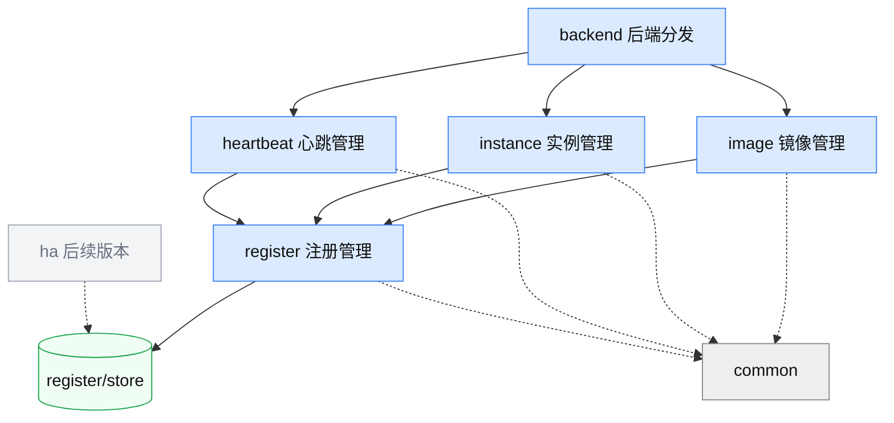

# 一体机 Agent OS registry 实现文档

> 配套[设计文档](./一体机Agent%20OS%20registry设计文档.md)（功能 / 场景 / 注册表）与 [`registry_openapi.yaml`](./registry_openapi.yaml)（接口契约）。本文档写 **1 整体项目架构** · **2 各模块功能与接口（依开发顺序）** · **3 数据库改造（SQLite / rqlite）**。

> **⚠️ 2026-08-11 需求变更（本文档下列旧内容以[设计文档](./一体机Agent%20OS%20registry设计文档.md)为准，尚未逐节重写）**：
> 1. **鉴权 → mTLS**：注册中心不做业务鉴权（`auth/` 不启用），组件间安全由传输层 mTLS 保证。§1.2 / §2.6 的"鉴权"描述作废。
> 2. **移除心跳**：注册中心不再收心跳，存活由 gateway 轮询元戎 List 驱动。**§2.3 heartbeat 模块下线**，`POST /api/nodes/{node}/heartbeat`、`/api/lease-config` 从契约移除；§2.5 中"据 node 心跳派生 status"作废。
> 3. **status 落库可改**：`status`（`运行` / `停止` / `异常`）为**落库列**（见上 §3.2 已加），由 gateway 经 `PATCH …/instances/{id}` 写入；条目持久、不随实例停止删除，删除由**用户**手动发起。

**目录**

- [1. 整体项目架构](#1-整体项目架构)
- [2. 各模块功能与接口（开发顺序）](#2-各模块功能与接口开发顺序)
  - [2.1 common（基础设施）](#21-common基础设施)
  - [2.2 register（注册管理 + 注册表）](#22-register注册管理--注册表)
  - [2.3 heartbeat（心跳管理）](#23-heartbeat心跳管理)
  - [2.4 image（镜像管理）](#24-image镜像管理)
  - [2.5 instance（实例管理）](#25-instance实例管理)
  - [2.6 backend（后端分发 + 启动）](#26-backend后端分发--启动)
  - [2.7 client（客户端 SDK）](#27-client客户端-sdk)
  - [2.8 ha（分布式高可用，后续版本）](#28-ha分布式高可用后续版本)
- [3. 数据库改造（SQLite / rqlite）](#3-数据库改造sqlite--rqlite)
  - [3.1 原则](#31-原则)
  - [3.2 表结构](#32-表结构)
  - [3.3 命名注册表与通用 CRUD](#33-命名注册表与通用-crud)
  - [3.4 向前兼容 A2X](#34-向前兼容-a2x)
  - [3.5 文件 → 库迁移](#35-文件--库迁移)
  - [3.6 rqlite（多机）](#36-rqlite多机)

---

## 1. 整体项目架构

### 1.1 模块与依赖

```
a2x_registry/
├── common/          # 模型 / 存储后端 / 错误 / 路径 / id（无业务依赖）
├── register/        # 注册管理（各表通用 CRUD）+ store（SQLite / rqlite）
├── heartbeat/       # 心跳管理（通用租约 + 可注入过期策略）
├── image/           # 镜像管理（注册 / 查询 / 注销 / 默认 / 取运行规格）
├── instance/        # 实例管理（注册 / 变更 / 注销 / 查询；纯记录，不调元戎）
├── backend/         # 后端分发（FastAPI app + 路由 + CLI 启动）
└── ha/              # 分布式高可用（rqlite + 成员 + 选主 + nginx 配置，后续版本）

client/              # 客户端 SDK（独立分发；httpx；不 import a2x_registry）
```

**依赖方向**（上层依赖下层，无环）：



### 1.2 技术栈与约定

- **Web**：FastAPI + uvicorn（**HTTP/1.1**，`uvicorn[standard]`）；**监听地址读 `registry.env` 的 `A2X_REGISTRY_BIND`（空 → `127.0.0.1`，不允许 `0.0.0.0`）**、不启鉴权（`auth/` 不初始化，请求匿名放行）。
- **持久化**：统一 SQL 后端——单机 **SQLite**、多机 **rqlite**。register 按**命名注册表**组织（`registry` 列分区、`(registry, service_id)` 主键），热查字段提**列**建索引、异构字段进 **`data` JSON**（详见 [§3](#3-数据库改造sqlite--rqlite)）。
- **心跳 / keep-alive**：uvicorn `timeout_keep_alive` **≥ 心跳间隔**（默认 75s > `ttl/3`），使 gateway 单条长连跨心跳复用。
- **并行 LLM**（如镜像 / 分类相关）：`ThreadPoolExecutor`，默认 20 workers。
- **启动分流**：systemd 同一单元 + `ConditionPathExists=/etc/a2x-registry/registry.env`——有文件即起；注册中心读 `registry.env`：`A2X_REGISTRY_MODE`（`appliance` 则启动时建镜像 / 实例表，否则只建服务表）、`A2X_REGISTRY_HA_MEMBERS`（**三分**：空 → 单机 SQLite、只填本机 IP → 单机单节点 rqlite、多 IP → 多节点 rqlite）、`A2X_REGISTRY_BIND`（空 → `127.0.0.1`、设业务 IP 则绑该网卡）。**`ExecStart` 不含监听 IP**。无文件则不起（纯 gateway 节点）。

### 1.3 存储

持久化用统一 SQL 后端——单机 **SQLite**、多机 **rqlite**（可复制 SQLite）。register 统一管理**命名注册表**（service / image / instance 三 kind），**表结构、命名注册表、A2X 兼容、文件→库迁移见 [§3 数据库改造](#3-数据库改造sqlite--rqlite)**。

---

## 2. 各模块功能与接口（开发顺序）

> 每个模块给**功能** + **对外接口**（关键函数 / 类 + 它服务的 REST 端点，若有）。REST 完整契约见 `registry_openapi.yaml`。

### 2.1 common（基础设施）

**功能**：跨模块共享的模型、存储后端抽象、错误、路径解析、id 派生。无业务依赖，最先开发。

**接口**：

| 项 | 说明 |
|----|------|
| `Backend` | 存储后端抽象；`connect(cfg)` → `Backend(kind="sqlite"/"rqlite", conn=…)`。屏蔽单机 / 多机差异 |
| `now_iso()` | 服务端时间戳（ISO8601）|
| `image_sid(name, version)` | 镜像 service_id 派生：`f"image_{sha256(name+'|'+version)[:16]}"`（每 name 每 version 一行）|
| `instance_sid(user, framework)` | 实例 service_id 派生：`f"generic_{sha256(user+'|'+framework)[:8]}"`（**确定性**：每用户每框架唯一 → 一个实例）|
| `paths.config_path()` | 解析 `A2X_REGISTRY_HOME`/`registry.env` 等配置路径 |
| 错误类型 | `NotFoundError` / `ValidationError` / `NotOwnedError` / `ImageInUseError` / `ExternalDependencyError`（映射 404/400/403/409/502）|

> 实例 `service_id` 由 `instance_sid(user, framework)` **确定性派生**（每用户每框架一个实例，单例即由此保证）；SDK / gateway 计算后随注册带上，并据此寻址变更 / 注销。

### 2.2 register（注册管理 + 注册表）

**功能**：所有注册对象（service / agent / skill / image / instance）的**统一持久化层**——按**命名注册表**（`registry` 名，如 `toolret` / `publicmcp` / `default` / `镜像注册表` / `实例注册表`）组织，每张有 **kind**（`service` / `image` / `instance`，决定物理表与热查列）。镜像 / 实例 / 心跳经它读写，不直接碰存储。**表结构、命名注册表映射、A2X 兼容、文件→库迁移与 rqlite 详见 [§3 数据库改造](#3-数据库改造sqlite--rqlite)**。

**通用 CRUD**（`register/service.py`）：

| 函数 | 功能 |
|------|------|
| `create_registry(name, kind)` | 登记一张命名注册表（`kind ∈ service/image/instance`），幂等；据 kind 决定落哪张物理表与热列（§3.3）|
| `register(name, entry) -> dict` | 幂等 **upsert**（按 `service_id`）；提升列 + `data` JSON 分离写 |
| `patch(name, service_id, fields) -> dict` | **部分更新**（如实例变更 node/address）；不存在则 `404` |
| `deregister(name, service_id) -> bool` | 删条目（幂等：已删回 `False`）|
| `query(name, filter=None) -> list[dict]` | 字段等值过滤读（命中热列走索引）；合并列 + `data` 还原整条 entry |

**兼容现有 A2X**（保留、内部走上面通用 CRUD，`name=dataset`、`kind=service`）：`register_generic` / `register_a2a` / `register_skill` / `deregister(dataset, sid)` / `update_service` / `list_services` / `reserve_services` 等——服务发现、taxonomy、预留租约照旧（§3.4）。

**store**（`register/store.py`）：SQLite / rqlite 连接 + 建表（§3.2）；`registry_meta` 名字→kind 路由；`data` JSON 编解码。

### 2.3 heartbeat（心跳管理）

**功能**：通用**租约续期 + 过期扫描 + 过期回调**（活性内存态）。租约以 `key` 为键——一体机场景 `key = nodeIP`（gateway 按 node 心跳）；船只 / 通用场景 `key = service_id`。**「过期做什么」由场景注入策略**：一体机注入实例模块的 `expire_node`（过宽限 → 删该 node 全部实例），通用用默认 `deregister`。

**接口**：

| 项 | 功能 |
|----|------|
| `store.beat(key) -> Lease` | 续租（首次心跳即装租约）|
| `store.is_expired(key) -> bool` | 该 key 是否失活（供实例查询派生 status）|
| `store.recover_from_persisted(keys)` | 重启后各 key 入宽限租约 |
| `HeartbeatManager(on_expire)` | 注入过期处理器；周期 `sweep_expired()` → 对超宽限 key 调 `on_expire(key)` |
| **REST** `POST /api/nodes/{node}/heartbeat` | node 续租（节点级：覆盖该 node 全部实例）|
| **REST** `GET/POST /api/lease-config` | 查 / 改 `{enabled, min_ttl, max_ttl, grace_period}` |

### 2.4 image（镜像管理）

**功能**：三方框架镜像的注册 / 查询 / 注销、多版本与默认版本、**取运行规格**。启动时 `create_registry("镜像注册表", "image")`，之后经注册管理对**命名注册表 `镜像注册表`** 读写（表结构见 [§3.2](#32-表结构)），不直接碰存储。适配镜像由外部镜像处理模块产出，此处只登记引用 + 元戎运行规格。

**接口**（`image/service.py`）：

| 函数 | 功能 |
|------|------|
| `register_image(name, version, spec, by, **fields) -> dict` | 登记**一行**（该 name 该 version，幂等 upsert）；写 `uploaded_by=by`、`version_key=version_key(version)`（§3.2）、`framework`/`description`/`package_path`/`image_archive_path`/`access_mode` 等；该 name 无默认版本时置 `is_default=1` |
| `query(filters, size, page) -> (list[dict], int)` | 读版本行、**扁平返回**（一条目 = 一行，`name` / `framework` / `is_default` 为行上普通字段，不分组）；**分页单位 = 行**，返回 `(条目, 过滤后行数)` 供路由写 `X-Total-Count` |
| `deregister(name, version) -> dict` | **先校验无在用实例**（按该行 `framework`+`version` 查 `实例注册表`），无则删镜像仓文件 + **删该版本行**；删的是默认版本则把最新版补为默认 |
| `set_default(name, version)` / `get_default_version(name) -> str` | 设默认：清该 name 旧 `is_default`、置新版为 1；取默认：`WHERE name=? AND is_default=1`（未设取最新版本）|
| `resolve_launch_spec(name, version) -> dict` | 组合元戎运行规格（**扁平**）`{name, framework, version, imageurl, access_mode, workdir, mounts, cpu, memory, env}`；经注册管理**按 name+version 精确查一行**、抽取字段 |

**REST**（`image/router.py`）：

| 端点 | 映射 |
|------|------|
| `POST /api/images` | `register_image`（发起方：镜像处理模块）|
| `GET /api/images` | `query`（用户，`?name` / `?framework` / `?uploaded_by` / `?size` / `?page`；分页元数据走响应头）|
| `GET /api/images/{name}/launch-spec` | `resolve_launch_spec(name, version or get_default_version(name))`（gateway 拉起前查）|
| `PUT /api/images/{name}/default` | `set_default`（用户）|
| `DELETE /api/images/{name}/{version}` | `deregister`（用户；在用则 `409`）|

```python
def resolve_launch_spec(self, name, version) -> dict:
    v = self.register.query("镜像注册表",                        # 精确一行（列合并 data）
                            {"name": name, "version": version})[0]
    return {"name": name, "framework": v.get("framework"), "version": version,  # 供 gateway 记录
            "imageurl": v["imageurl"], "access_mode": v.get("access_mode"),
            "workdir": v.get("workdir"),                                # 扁平：一行一版本，无 rootfs 层
            "mounts": v.get("mounts"), "cpu": v.get("cpu"), "memory": v.get("memory"),
            "ports": v.get("ports"), "env": v.get("env")}
```

**`query` 的分页**：分页单位与存储单位同级（都是**行** = 一个 name 的一个 version），故是直白的 `LIMIT/OFFSET`——不分组、不需子查询，`name` / `framework` / `is_default` 作为普通列随行返回。

```python
def query(self, filters=None, size=-1, page=1) -> tuple[list[dict], int]:
    where, args = self._build_filter(filters)          # name / framework / uploaded_by → SQL 片段
    total = self.db.scalar(                            # X-Total-Count = 过滤后的行数
        f"SELECT COUNT(*) FROM image WHERE registry=? {where}", [self.reg, *args])
    sql = (f"SELECT * FROM image WHERE registry=? {where} "
           "ORDER BY name ASC, version_key DESC, "
           "         json_extract(data,'$.created_at') DESC")
    if size > 0:
        sql += " LIMIT ? OFFSET ?"; args = [*args, size, (page - 1) * size]
    return self.db.query(sql, [self.reg, *args]), total   # 扁平返回，列与 data JSON 合并
```

### 2.5 instance（实例管理）

**功能**：实例创建 / 注册 / 变更 / 删除 / 查询。**支持两种模式**（[需求变更 §7](./需求变更.md)）：**模式 B** 注册中心自己调元戎 `create_sandbox` / `delete_sandbox` 拉起 / 停止后再增 / 删条目；**模式 A**（向前兼容）仅登记 / 删除条目。判模式看形状（POST 有无 `runtime_spec`、DELETE 有无 `with_runtime`）。启动时 `create_registry("实例注册表", "instance")`，之后经注册管理读写（表结构见 [§3.2](#32-表结构)）。

**接口**（`instance/service.py`）：

| 函数 | 功能 |
|------|------|
| `register_instance(entry) -> dict` | **模式 A**：幂等 upsert 写条目（`service_id`/`kind`/…/可选 `instance_id`）。**模式 B**：先 in-flight 锁（同 `service_id` 在途 → `409 in_progress`）→ 已存在且活则回现有条目 → 否则经 `RuntimeManager` 调元戎创建、`get_agent_info` 回填 `node`/`address`/`instance_id` → **成功后**写条目（写失败重试 N 次仍失败报错+记日志）|
| `update_instance(sid, fields) -> dict` | **变更**：部分更新 `node`/`address`/`instance_id`（经 `register.patch`）；不存在则 `404` |
| `deregister_instance(sid, with_runtime) -> dict` | 单个 / `ALL`（删全部，暂不提供过滤）。**模式 B**（`with_runtime`）：按条目 `instance_id` 调元戎 `delete_sandbox` 成功后删条目；批量 `asyncio.gather` 限流、逐条报结果、部分失败不回滚 |
| `list_instances(filter, include_unhealthy, size, page) -> (list[dict], int)` | 查询 + 据 node 心跳派生 `status`；`include_unhealthy=false` 只回 `运行`。排序 `framework, "user", service_id`；**先过滤后分页**，返回 `(条目, 过滤后总数)` |
| `expire_node(node) -> None` | 心跳注入：删该 node 全部实例（过宽限）|

`service_id = "{user}+{framework}"`（首个 `+` 拆回），`kind` 由 `framework == "jiuwenswarm"`（jiuwenswarm `BUILTIN_AGENT_TYPE`）判。

**REST**（`instance/router.py`，POST/DELETE 均 `async def`）：

| 端点 | 映射 |
|------|------|
| `POST /api/instances` | `register_instance`（有 `runtime_spec` → 模式 B 调元戎）|
| `PATCH /api/instances/{sid}` | `update_instance`（node/address/instance_id/status 变更）|
| `DELETE /api/instances/{sid}` | `deregister_instance`（`?with_runtime` → 模式 B；`{sid}=ALL` 删全部，暂不提供过滤）|
| `GET /api/instances` | `list_instances`（`?include_unhealthy`/`?node`/`?framework`/`?kind`/`?user`/`?size`/`?page`）|

**`instance/runtime.py`【新增】—— 元戎运行时客户端 + 编排**（复用 jiuwenswarm 模式）：

| 项 | 说明 |
|----|------|
| `RuntimeManager.create(name, workspace, version, runtime_spec, env_vars, mounts) -> dict` | 移植 jiuwenswarm `YuanrongFrontendAgentClient`：`urllib` 打 `POST /api/agent`（**零新依赖**，与 rqlite/etcd 客户端一致）、`asyncio.to_thread` 不阻塞事件循环、超时 300s、`code==200` 校验 → 返回 `instance_id`；再 `get_agent_info`（`GET /api/agent/:id`）取 `node_ip`/`sandbox_ip` |
| `RuntimeManager.delete(instance_id)` | `DELETE /api/agent/:id`（同上包 `to_thread`）|
| in-flight 锁 | `dict[service_id, asyncio.Lock/Task]`；同 `service_id` 同时刻仅一个在途操作，其余 `409` |
| 配置 | 新增 env：元戎 `frontend_endpoint` + `namespace`（registry 配置优先）+ 超时；未配则模式 B 返回 `501 runtime_not_configured` |

下面 `_write_entry` 是两模式共用的**条目写入核心**；模式 B 在其外层加「元戎调用 + 回填 + 重试」编排：

```python
def _write_entry(self, entry) -> dict:                     # 两模式共用
    now = now_iso()
    row = {"service_id": entry["service_id"], "kind": entry["kind"],
           "framework": entry["framework"], "framework_version": entry["framework_version"],
           "node": entry["node"], "address": entry["address"], "user": entry["user"],
           "instance_id": entry.get("instance_id"),
           "created_at": now, "last_active_at": now}
    return self.register.register("实例注册表", row)        # 幂等 upsert

async def register_instance(self, req) -> dict:
    if "runtime_spec" not in req:                          # 无 runtime_spec → 模式 A
        return self._write_entry(req)
    sid = req["name"]                                      # = user+framework
    user, framework = sid.split("+", 1)                   # 首个 + 拆
    async with self._inflight(sid):                       # 同 sid 在途 → 409 in_progress
        cur = self.register.query("实例注册表", {"service_id": sid})
        if cur and self._alive(cur[0]):                   # 已存在且活 → 幂等
            return cur[0]
        iid = await self._rt.create(sid, req["workspace"], req["runtime_spec"],
                                    req.get("env_vars"), req.get("mounts"))  # 元戎成功才继续
        node, addr = await self._rt.get_landing(iid)      # get_agent_info 回填
        entry = {"service_id": sid, "user": user, "framework": framework,
                 "kind": "九问" if framework == BUILTIN_AGENT_TYPE else "三方",
                 "framework_version": req["version"], "node": node,
                 "address": addr, "instance_id": iid}
        return self._retry(lambda: self._write_entry(entry), n=N)  # 写失败重试 N 次
```

**`status` 与分页的相互作用**（易错点）：`status` 不落库、由 node 心跳在**内存**派生，所以 `include_unhealthy=false` 的过滤**不能**「先全量捞出 → 逐行派生 status → 内存过滤 → 再切片」——那样 `LIMIT/OFFSET` 就形同虚设，`X-Total-Count` 也得靠内存数。

正确做法：心跳活性本就在 leader 内存里（§3.6），**失活 node 集合是个小集合**，把它作为参数下推成 `node NOT IN (…)`，过滤与分页就都回到 SQL 里：

```python
def list_instances(self, filters=None, include_unhealthy=False,
                   size=-1, page=1) -> tuple[list[dict], int]:
    where, args = self._build_filter(filters)              # node/framework/kind/user
    if not include_unhealthy:                              # 只回 运行 → 排除失活 node
        dead = self.hb.expired_nodes()                     # 内存小集合，非查库
        if dead:
            where += f" AND node NOT IN ({','.join('?' * len(dead))})"
            args += list(dead)
    total = self.db.scalar(f"SELECT COUNT(*) FROM instance WHERE registry=? {where}",
                           [self.reg, *args])
    sql = (f"SELECT * FROM instance WHERE registry=? {where} "
           'ORDER BY framework ASC, "user" ASC, service_id ASC')
    if size > 0:
        sql += " LIMIT ? OFFSET ?"; args = [*args, size, (page - 1) * size]
    return [self._with_status(r) for r in self.db.query(sql, [self.reg, *args])], total
```

> `_with_status` 只在**本页的行**上派生 `status`（此时必为 `运行`，除非 `include_unhealthy=true`），不再触碰全表。

### 2.6 backend（后端分发 + 启动）

**功能**：组装 FastAPI app、挂载各模块路由、CLI 启动（uvicorn）、据配置文件决定单机 / 分布式。

**接口**：

| 项 | 功能 |
|----|------|
| `app.py` | 建 `FastAPI`、不启鉴权；挂载 image / instance / heartbeat 路由（ha 路由为后续版本）|
| `__main__.py` | CLI 入口：**命令不含监听 IP**；读 `registry.env`——`A2X_REGISTRY_MODE`（`appliance` 则装镜像 / 实例模块并启动建其表）、`A2X_REGISTRY_BIND`（空 → `127.0.0.1`）作监听地址、`A2X_REGISTRY_PORT`（默认 8000）、`A2X_REGISTRY_HA_MEMBERS`（空 → 单机 SQLite、只填本机 IP → 单节点 rqlite、多 IP → 多节点 rqlite）；`--keep-alive` 默认 75s |
| **启动**（非 REST）| `a2x-registry`（systemd `ExecStart`，`ConditionPathExists=/etc/a2x-registry/registry.env`）|

```python
def main():
    args = parse_args()                       # 仅 --keep-alive（不含 --host / 监听 IP）
    mode = os.environ.get("A2X_REGISTRY_MODE", "")                    # "" 通用 / "appliance" 一体机
    bind = os.environ.get("A2X_REGISTRY_BIND", "") or "127.0.0.1"     # 空 → localhost，不允许 0.0.0.0
    port = int(os.environ.get("A2X_REGISTRY_PORT", "") or 8000)
    members = [m.strip() for m in os.environ.get("A2X_REGISTRY_HA_MEMBERS", "").split(",") if m.strip()]
    backend = connect(cfg(ha_members=members))   # 三分：[] → sqlite；[本机IP] → 单节点 rqlite；
                                                 # 多 IP → 多节点 rqlite（自组集群，后续版本）
    app = build_app(backend, appliance=(mode == "appliance"))        # 启动即建表：通用只建 service；
    uvicorn.run(app, host=bind, port=port,                           # appliance 另建 image/instance（§3.3）
                timeout_keep_alive=args.keep_alive)   # HTTP/1.1 长连
```

### 2.7 client（客户端 SDK）

**功能**：gateway 侧 SDK——镜像规格查询、实例注册 / 变更 / 注销、node 心跳续约（**不调元戎**——拉起 / 停止由 gateway 自行完成，SDK 只经 HTTP 调注册中心）。复用单条 `httpx.Client`（HTTP/1.1 keep-alive 连接池）；同步 `client.py`、异步 `async_client.py` 镜像接口。**独立分发，不 import `a2x_registry`**。

**接口**：

| 方法 | 映射 |
|------|------|
| `get_launch_spec(ds, name, version=None) -> dict` | `GET …/images/{name}/launch-spec`（拉起前拿规格）|
| `register_instance(ds, kind, framework, framework_version, node, address, user, instance_id=None) -> dict` | 内部 `service_id = instance_sid(user, framework)` → `POST …/instances` |
| `update_instance(ds, service_id, node=None, address=None, instance_id=None) -> dict` | `PATCH …/instances/{sid}`（变更）|
| `deregister_instance(ds, service_id) -> dict` | `DELETE …/instances/{sid}` |
| `node_heartbeat(node) -> dict` | `POST /api/nodes/{node}/heartbeat` |
| `list_instances(ds, **filters) -> list` | `GET …/instances`（前端 / 运维用）|

### 2.8 ha（分布式高可用，后续版本）

**功能**：分布式主备——rqlite 复制 + 选主、成员管理、**保持 nginx 指向当前主**。730 单机不含此模块。

**接口**：

| 项 | 功能 |
|----|------|
| rqlite 后端 | 各节点内置，Raft 复制持久态、选主；`Backend(kind="rqlite")`，SQL 接口不变 |
| `GET /api/ha/leader` | 返回当前主（任一节点据 Raft 权威回主）；**供注册中心配置 nginx**，gateway 不直接调用 |
| `GET/POST /api/ha/members` | 查看 / 变更成员集 |
| nginx 配置管理 | 主（leader）在选主 / 切换时把 **nginx upstream 指向自己**；gateway 一律发 nginx，nginx 转发到当前主 |
| 心跳分层 | 镜像 / 实例注册（持久态）经 rqlite 复制；node 心跳活性由 leader 内存跟踪、不进 rqlite；切换后各 node gateway 重新心跳重建 |

> **启动门控**：分布式各节点均放 `registry.env`（`A2X_REGISTRY_HA_MEMBERS` 填**全部成员 IP**，即多 IP）→ systemd 起注册中心 + rqlite；纯 gateway 节点不放该文件 → 不起（见设计文档 §3.3.1）。注意 `HA_MEMBERS` 非空**不等于**本模块生效——只填本机 IP 是**单节点 rqlite**（§3.6），不进本模块的复制 / 选主 / nginx 逻辑。

---

## 3. 数据库改造（SQLite / rqlite）

register 的持久化从**文件式 JSON**（现有 `api_config.json` 等）迁到**统一 SQL 后端**——单机 **SQLite**、多机 **rqlite**（可复制 SQLite）。本章是 §2.2 / §2.4 / §2.5 的存储落地。

### 3.1 原则

- **单库 + `registry` 列分区**，不分表、不分库：rqlite 只复制**一个库**，动态表名 / 多库都不可行；隔离靠 `WHERE registry=?` + 索引，等价于现有目录隔离。
- **热字段提列**（建索引、供 `WHERE`）**+ 异构字段进 `data` JSON**（SQLite JSON1）。
- **向前兼容 A2X**：服务发现 / taxonomy / 预留租约不变（§3.4）。

### 3.2 表结构

```sql
-- 注册表登记：有哪些命名注册表 + 各自 kind + 配置
CREATE TABLE registry_meta (
  registry TEXT PRIMARY KEY,             -- 'toolret'/'publicmcp'/'default'/'镜像注册表'/'实例注册表'
  kind     TEXT NOT NULL,                -- service | image | instance
  config   TEXT                          -- JSON：service 类存 register_config/vector_config/taxonomy_hash
);

-- 服务（A2X：generic/a2a/skill）——发现 / 分类基于它
CREATE TABLE service (
  registry    TEXT NOT NULL,
  service_id  TEXT NOT NULL,
  type        TEXT NOT NULL,             -- generic | a2a | skill
  source      TEXT NOT NULL,             -- user_config | api_config | ephemeral | skill_folder
  name        TEXT,                      -- 热：分类 LLM 输入 / 过滤
  description TEXT,                      -- 热：分类 LLM 输入
  data        TEXT NOT NULL,             -- JSON：service_data / agent_card / skill_data
  created_at  TEXT NOT NULL,
  updated_at  TEXT NOT NULL,
  PRIMARY KEY (registry, service_id)
);
CREATE INDEX idx_service_type ON service(registry, type);

-- 镜像（一行一版本）
CREATE TABLE image (
  registry          TEXT NOT NULL,
  service_id        TEXT NOT NULL,               -- image_sid(name, version)
  name              TEXT NOT NULL,               -- 热：主键定位字段（取代 framework）；按 name 查 / 分组 / 定默认
  framework         TEXT,                        -- 展示字段（普通，可筛选、非主键）
  version           TEXT NOT NULL,               -- 热：按版本查（原 framework_version 更名）
  version_key       TEXT NOT NULL,               -- 排序：version 的规范化键，注册时算好（见下）
  is_default        INTEGER NOT NULL DEFAULT 0,  -- 该 name 默认版本标记（每 name 恰一行=1）；不参与排序
  uploaded_by       TEXT,                        -- 热：按上传者筛选；九问预置条目为 'system'
  data              TEXT NOT NULL,               -- JSON 扁平（无 rootfs 层）：{description, package_path,
                                                 --   image_archive_path, imageurl, access_mode, workdir, mounts,
                                                 --   cpu, memory, ports, env, image_module_version, created_at}
  PRIMARY KEY (registry, service_id)
);
CREATE INDEX idx_image_name    ON image(registry, name);
CREATE INDEX idx_image_name_ver ON image(registry, name, version);
CREATE INDEX idx_image_by      ON image(registry, uploaded_by);
CREATE INDEX idx_image_order   ON image(registry, name, version_key DESC);  -- 覆盖列表排序

-- 实例（status 落库，由 gateway 据元戎 List 写入；注册中心不派生、不自动剔除）
CREATE TABLE instance (
  registry          TEXT NOT NULL,
  service_id        TEXT NOT NULL,       -- instance_sid(user, framework)
  kind              TEXT NOT NULL,       -- 三方 | 九问
  status            TEXT NOT NULL DEFAULT '运行',  -- 运行 | 停止 | 异常（gateway 写；include_unhealthy=false 下推 status='运行'）
  framework         TEXT,
  framework_version TEXT,
  node              TEXT,                -- 热：按节点查
  "user"            TEXT,                -- 热：按用户 ID 查该用户实例
  data              TEXT NOT NULL,       -- JSON {address, instance_id, created_at, last_active_at}（instance_id=元戎实例 ID，可空）
  PRIMARY KEY (registry, service_id)
);
CREATE INDEX idx_instance_node ON instance(registry, node);
CREATE INDEX idx_instance_status ON instance(registry, status);
CREATE INDEX idx_instance_fw   ON instance(registry, framework, framework_version);
CREATE INDEX idx_instance_user ON instance(registry, "user");
CREATE INDEX idx_instance_order ON instance(registry, framework, "user", service_id);  -- 覆盖列表排序
```

**`version_key` 派生**（`image/version_key.py`，注册时算一次落库、之后只读）。之所以落库而非查询时算：列表排序必须在 SQL 内完成才能与 `LIMIT/OFFSET` 一起下推，而 SQLite 无法在 SQL 里解析语义化版本号。

```python
import re
_SEMVER = re.compile(r"^v?(\d+)\.(\d+)\.(\d+)(?:-(.+))?$")

def version_key(version: str) -> str:
    """v0.2.0 → '00000.00002.00000~'；v0.10.0 → '00000.00010.00000~'（补零后正确大于 v0.2.0）
    v0.2.0-beta → '00000.00002.00000-beta'（'~'=0x7E 大于任何字母与 '-'，
    故降序时正式版排在同号预发布版之前）；不合规 → 全零，排在该 name 合规版本之后。"""
    m = _SEMVER.match(version.strip())
    if not m:
        return "00000.00000.00000"                       # 兜底：组内再按 created_at 降序
    major, minor, patch, pre = m.groups()
    base = f"{int(major):05d}.{int(minor):05d}.{int(patch):05d}"
    return f"{base}-{pre}" if pre else f"{base}~"
```

### 3.3 命名注册表与通用 CRUD

- `create_registry(name, kind)`（**启动时调**）：确保该 kind 的**物理表存在**（`CREATE TABLE IF NOT EXISTS`）+ 往 `registry_meta` 登记 `name → kind`。**建表只在启动时发生**、运行时（每次 register）不再 DDL——rqlite 无法在运行时动态建表，故启动预建齐。
- `register` / `patch` / `deregister` / `query(name, …)` 据该 name 的 kind **路由到 service / image / instance 物理表**，`registry` 列 = name。
- **按启动模式建表**（`A2X_REGISTRY_MODE`，见设计文档 §3.3.1）：通用模式启动只 `create_registry` **service 表**；`appliance` 模式另由镜像 / 实例管理 `create_registry("镜像注册表","image")` / `create_registry("实例注册表","instance")`，启动即建齐 **image / instance 表**。
- A2X 的 dataset（`toolret` / `publicmcp` / `default`）= kind=service 的注册表（`registry` = dataset 名）；三者共存一库、互不干扰。

### 3.4 向前兼容 A2X

- **SQLite 作 CRUD 真源**：`register_generic` / `register_a2a` / `register_skill` / `update_service` / `reserve_services` 等保留，内部走通用 CRUD（`name=dataset`、`kind=service`）。
- **继续物化文件**：写表后把该 registry 的 service 行投影成 `service.json` 落盘；`taxonomy/*.json`、`skills/` 仍留文件 → A2X build / search / vector **代码不动**、照读文件；`registry_meta.config.taxonomy_hash` 判分类 stale。
- **预留租约 `_leases`** 保持内存、不落库（现有即 volatile，重启即清）。

### 3.5 文件 → 库迁移

启动时若检测到旧 JSON（`api_config.json` / `user_config.json` / `skills/`），一次性导入 SQLite（幂等，按 `registry + service_id` upsert），之后照常物化输出文件。存量数据零改动、平滑切换。

### 3.6 rqlite（单节点 / 多机）

`A2X_REGISTRY_HA_MEMBERS` **三分**决定后端（设计文档 §3.3.1 / §4.1）：

| `A2X_REGISTRY_HA_MEMBERS` | 后端 | 说明 |
|---|---|---|
| 空 | SQLite | 最轻量，无 Raft 开销；扩容需一次存储迁移 |
| 只填**本机 IP**（如 `192.168.0.11`）| **单节点 rqlite** | 自身即 leader，无对端复制。**为平滑扩容预留** |
| 多 IP | 多节点 rqlite | Raft 复制 + 选主（后续版本）|

同一套表经 Raft 复制：写打 leader、复制多数派提交；`common.connect()` 后端由 SQLite 换 rqlite，**SQL 不变**。node 心跳活性由 leader 内存跟踪、不进 rqlite（§2.3 / §2.8）。

> **单节点 rqlite 的意义**：它与多节点走**同一套 SQL 方言与建表约束**（§3.3：表须启动时 `CREATE TABLE IF NOT EXISTS` 建齐，运行时不得 DDL），故单机先跑 rqlite 的部署，日后往 `A2X_REGISTRY_HA_MEMBERS` 追加对端 IP 重启即扩成主备——**不迁数据、不改代码路径**。选 SQLite 则最轻，但扩容时要迁一次库。两者对上层 CRUD、表结构、REST 行为**完全一致**。
